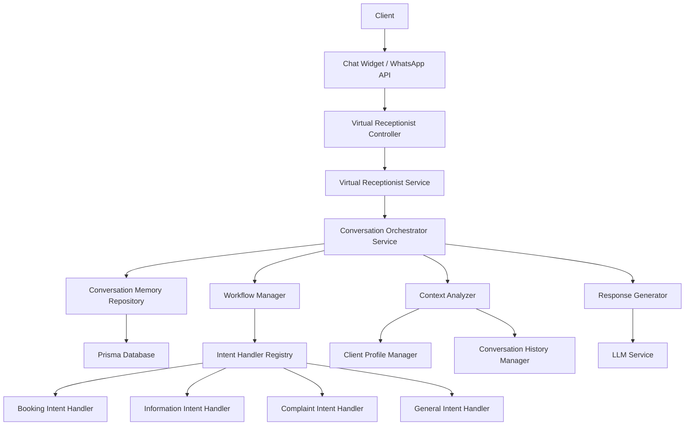

# Conversation Orchestrator Service Architecture

## Overview

The Conversation Orchestrator Service is a comprehensive enhancement to the virtual receptionist system that introduces advanced conversation management and context-aware response generation capabilities.

## Architecture Diagram



## Core Components

### 1. Conversation Orchestrator Service

The main orchestrator that manages the entire conversation lifecycle:

**Key Responsibilities:**
- Coordinate conversation flow
- Manage context switching between intents
- Maintain conversation state
- Handle multi-turn conversations
- Determine when to hand off to human agent

**Methods:**
- `orchestrateConversation()` - Main orchestration method
- `switchIntent()` - Switch between conversation intents
- `manageContext()` - Maintain and update conversation context
- `determineNextStep()` - Determine the next step in the conversation
- `shouldHandoff()` - Decide if conversation should be handed off to human

### 2. Conversation Memory Repository

Persistent storage for conversation history:

**Key Features:**
- Store entire conversation history for each client
- Track conversation metadata (timestamps, channels, etc.)
- Support for conversation versioning
- Indexing for fast retrieval
- Integration with Prisma ORM

**Data Structure:**
```typescript
interface ConversationMemory {
  id: string;
  clientId: string;
  salonId: string;
  conversationId: string;
  channel: 'whatsapp' | 'web';
  messages: ChatMessage[];
  context: Record<string, any>;
  intentHistory: IntentHistoryItem[];
  createdAt: Date;
  updatedAt: Date;
}
```

### 3. Workflow Manager

Advanced workflow management system:

**Key Features:**
- Intent handler registry
- Dynamic workflow configuration
- State transitions between conversation stages
- Support for conditional branching
- Error handling and recovery

**Workflow Definition:**
```typescript
interface ConversationWorkflow {
  id: string;
  name: string;
  initialStage: string;
  stages: ConversationStage[];
  transitions: ConversationTransition[];
  handlers: IntentHandler[];
}

interface ConversationStage {
  id: string;
  name: string;
  description: string;
  requiredContext: string[];
  intentHandlers: string[];
}
```

### 4. Context Analyzer

Advanced context analysis component:

**Key Responsibilities:**
- Analyze conversation context
- Extract client profile information
- Track intent history
- Identify context gaps
- Determine context relevance

**Methods:**
- `analyzeContext()` - Analyze current conversation context
- `extractClientProfile()` - Extract client profile from context
- `trackIntentHistory()` - Track intent transitions
- `identifyContextGaps()` - Identify missing context information
- `assessContextRelevance()` - Determine context relevance

### 5. Client Profile Manager

Client profile and history tracking:

**Key Features:**
- Client profile storage (name, email, phone, preferences)
- Interaction history tracking
- Booking history
- Service preferences
- Communication preferences

**Data Structure:**
```typescript
interface ClientProfile {
  id: string;
  clientId: string;
  salonId: string;
  name: string;
  email: string;
  phone: string;
  preferences: ClientPreferences;
  interactionHistory: ClientInteraction[];
  bookingHistory: ClientBooking[];
  servicePreferences: string[];
  createdAt: Date;
  updatedAt: Date;
}
```

### 6. Response Generator

Context-aware response generation:

**Key Features:**
- Context-aware response templates
- Personalized responses based on client profile
- Integration with LLM service
- Response variation generation
- Multi-language support

**Methods:**
- `generateResponse()` - Generate context-aware response
- `personalizeResponse()` - Personalize response for client
- `generateResponseVariations()` - Generate response variations
- `validateResponse()` - Validate response quality

## Implementation Steps

### Phase 1: Foundation
1. Create Conversation Memory Repository
2. Enhance ConversationService with persistent storage
3. Implement Conversation Orchestrator Service
4. Create Prisma schema for conversation memory

### Phase 2: Advanced Features
5. Implement Workflow Manager
6. Create Context Analyzer
7. Implement Client Profile Manager
8. Enhance Response Generator

### Phase 3: Integration
9. Update VirtualReceptionistService to use orchestrator
10. Enhance Chat Widget with context display
11. Add WhatsApp integration improvements
12. Test the enhanced system

## Benefits

1. **Improved Conversation Flow:** Advanced orchestration for natural conversations
2. **Context Awareness:** Responses based on full conversation history
3. **Personalization:** Client-specific responses using profile information
4. **Persistence:** Long-term conversation memory for future interactions
5. **Scalability:** Modular architecture supports future enhancements
6. **Analytics:** Better conversation analytics and reporting
7. **Handoff Improvements:** Smoother transition to human agents

## Technical Stack

- NestJS for backend
- Prisma for database access
- PostgreSQL for persistent storage
- TypeScript for type safety
- Zod for validation
- Redis for caching
- Socket.io for real-time communication
