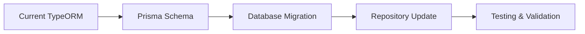
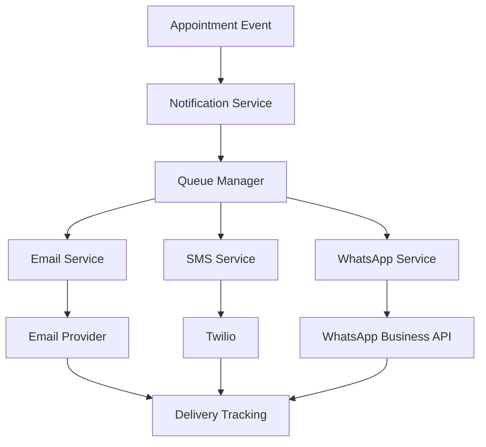

# ⚠️ DEPRECATED: KiraRoom SaaS MVP Development Roadmap

> **This document is deprecated.**
> **Current Plan:** [`CONSOLIDATED-PLAN.md`](CONSOLIDATED-PLAN.md) is the single source of truth.
> 
> This file is kept for historical reference only.

---

## Executive Summary

**Project**: KiraRoom Beauty Salon Management Platform
**Current Status**: Core appointment booking functionality completed, backend API operational
**Timeline**: ASAP (Prioritized 2-4 week delivery)
**Architecture**: NestJS + React + PostgreSQL + Docker

## Current State Assessment

### ✅ Completed Features
- Backend API with NestJS framework
- Database entities with proper relationships (TypeORM currently)
- Frontend booking widget with complete UI/UX
- API integration layer
- Type safety across all packages
- Multi-tenant architecture foundation

### ❌ Missing Critical Components
- Database setup and migrations (PostgreSQL)
- Environment configuration
- Notification system (Email, WhatsApp, SMS)
- Authentication & user management
- Testing suite
- Deployment pipeline

## Detailed Action Plan

### Phase 1: Foundation Setup (Week 1)

#### 1.1 Database Migration to Prisma ORM
**Priority**: HIGH | **Effort**: 2-3 days
- Migrate from TypeORM to Prisma for better developer experience
- Generate Prisma schema from existing entities
- Create migration scripts
- Set up database seeding for development
- Update all repository patterns



#### 1.2 Environment Configuration
**Priority**: HIGH | **Effort**: 1 day
- Set up `.env` files for all environments
- Configure PostgreSQL connection
- Set up environment variables for:
  - Database connection
  - JWT secrets
  - SMTP settings
  - Twilio credentials
  - WhatsApp Business API
  - Redis cache

#### 1.3 Frontend Configuration Fix
**Priority**: HIGH | **Effort**: 1-2 days
- Fix Vite configuration issues
- Update React dependencies
- Configure build scripts
- Set up proper TypeScript paths
- Fix API client environment variables

### Phase 2: Core Backend Completion (Week 1-2)

#### 2.1 Authentication System
**Priority**: HIGH | **Effort**: 3-4 days
- JWT-based authentication
- User registration/login
- Password reset functionality
- Role-based access control (owner, admin, staff, client)
- Multi-tenant user isolation
- Session management

**Implementation Steps**:
1. Implement auth controllers and services
2. Add JWT strategy and guards
3. Create user registration flow with salon creation
4. Add password hashing and validation
5. Implement refresh token mechanism
6. Add rate limiting for auth endpoints

#### 2.2 Notification System
**Priority**: HIGH | **Effort**: 4-5 days
- Email notifications (booking confirmations, reminders)
- SMS notifications via Twilio
- WhatsApp Business API integration
- Notification queue system with Redis
- Template management system
- Delivery tracking and retry logic

**Architecture**:


### Phase 3: System Integration & Testing (Week 2)

#### 3.1 Complete API Integration
**Priority**: HIGH | **Effort**: 2-3 days
- Connect frontend to backend APIs
- Implement proper error handling
- Add request/response validation
- Implement retry mechanisms
- Add loading states and error boundaries

#### 3.2 Comprehensive Testing Suite
**Priority**: MEDIUM | **Effort**: 3-4 days
**Testing Strategy**: Unit + Integration + E2E
- **Unit Tests**: Business logic, services, utilities (70% coverage)
- **Integration Tests**: API endpoints, database operations
- **E2E Tests**: Complete booking flow, user journeys
- **Performance Tests**: Load testing for API endpoints

**Testing Tools**:
- Jest for unit/integration tests
- Cypress for E2E tests
- Supertest for API testing
- Docker Compose for test database

### Phase 4: Deployment & Production Setup (Week 3)

#### 4.1 Docker & VPS Configuration
**Priority**: MEDIUM | **Effort**: 2-3 days
- Create production-ready Dockerfiles
- Set up Docker Compose for full stack
- Configure nginx reverse proxy
- Set up SSL certificates (Let's Encrypt)
- Configure environment-specific settings

#### 4.2 CI/CD Pipeline
**Priority**: MEDIUM | **Effort**: 2 days
- GitHub Actions workflow
- Automated testing on push
- Docker image building
- Database migration on deployment
- Health checks and rollback mechanism

#### 4.3 Monitoring & Logging
**Priority**: MEDIUM | **Effort**: 1-2 days
- Application logging with Winston
- Error tracking with Sentry
- Performance monitoring
- Database monitoring
- Health check endpoints

### Phase 5: Security & Performance (Week 3-4)

#### 5.1 Security Hardening
**Priority**: MEDIUM | **Effort**: 2 days
- Input validation and sanitization
- SQL injection prevention
- XSS protection
- CORS configuration
- Rate limiting
- API security headers

#### 5.2 Performance Optimization
**Priority**: MEDIUM | **Effort**: 2 days
- Database query optimization
- Redis caching implementation
- API response caching
- Frontend bundle optimization
- Image optimization
- CDN setup for static assets

## Technical Architecture Updates

### Database Schema (Prisma)
```prisma
model Tenant {
  id        String   @id @default(uuid())
  name      String
  slug      String   @unique
  // ... other fields
  users     User[]
  clients   Client[]
  // ... relations
}

model User {
  id        String   @id @default(uuid())
  email     String   @unique
  password  String
  role      UserRole
  tenantId  String
  tenant    Tenant   @relation(fields: [tenantId], references: [id])
  // ... other fields
}

// Additional models...
```

### Notification System Architecture
```typescript
interface NotificationService {
  sendEmail(template: EmailTemplate, data: any): Promise<void>;
  sendSMS(phone: string, message: string): Promise<void>;
  sendWhatsApp(phone: string, message: string): Promise<void>;
  queueNotification(notification: QueuedNotification): Promise<void>;
}
```

## Deployment Architecture

### VPS Setup (Docker-based)
```
┌─────────────────┐    ┌─────────────────┐    ┌─────────────────┐
│   Nginx Proxy   │    │   React App     │    │   NestJS API    │
│   (Port 80/443) │◄──►│   (Container)   │◄──►│   (Container)   │
└─────────────────┘    └─────────────────┘    └─────────────────┘
                                                        │
                                               ┌─────────────────┐
                                               │   PostgreSQL    │
                                               │   (Container)   │
                                               └─────────────────┘
                                                        │
                                               ┌─────────────────┐
                                               │     Redis       │
                                               │   (Container)   │
                                               └─────────────────┘
```

## Timeline & Milestones

### Week 1 (Days 1-7)
- [x] **Day 1-2**: Database migration to Prisma
- [x] **Day 3**: Environment configuration
- [x] **Day 4-5**: Frontend fixes and optimization
- [x] **Day 6-7**: Authentication system

### Week 2 (Days 8-14)
- [x] **Day 8-10**: Notification system implementation
- [x] **Day 11-12**: API integration completion
- [x] **Day 13-14**: Testing suite development

### Week 3 (Days 15-21)
- [x] **Day 15-16**: Docker & VPS deployment setup
- [x] **Day 17-18**: CI/CD pipeline
- [x] **Day 19-21**: Monitoring and logging

### Week 4 (Days 22-28)
- [x] **Day 22-23**: Security hardening
- [x] **Day 24-25**: Performance optimization
- [x] **Day 26-28**: Final testing and documentation

## Resource Requirements

### Development Effort
- **Backend Development**: 40-50 hours
- **Frontend Integration**: 20-25 hours
- **Testing & QA**: 15-20 hours
- **DevOps & Deployment**: 10-15 hours
- **Documentation**: 5-10 hours

### Infrastructure Costs (Monthly)
- **VPS (4GB RAM, 2 vCPU)**: $20-30
- **PostgreSQL Database**: $15-25
- **Redis Cache**: $10-15
- **Domain & SSL**: $10-15
- **Monitoring Tools**: $20-30
- **Total**: ~$75-115/month

## Risk Mitigation

### Technical Risks
1. **Database Migration Complexity**
   - Mitigation: Thorough testing, rollback procedures
2. **Notification Service Dependencies**
   - Mitigation: Fallback mechanisms, multiple providers
3. **VPS Performance Issues**
   - Mitigation: Load testing, auto-scaling setup

### Business Risks
1. **Timeline Pressure**
   - Mitigation: Prioritized feature list, MVP scope management
2. **Integration Complexity**
   - Mitigation: Modular architecture, incremental testing

## Success Metrics

### Technical KPIs
- API response time < 300ms
- 99.5% uptime
- Zero critical security vulnerabilities
- 80%+ test coverage

### Business KPIs
- Complete booking flow functional
- All notification channels working
- Multi-tenant isolation verified
- Production deployment successful

## Next Steps

1. **Immediate Actions** (This Week):
   - Set up development environment with Prisma
   - Configure PostgreSQL database
   - Begin authentication system implementation

2. **This Month Goal**:
   - Deploy functional MVP to production VPS
   - Complete notification system integration
   - Establish monitoring and maintenance procedures

3. **Future Enhancements** (Post-MVP):
   - Advanced reporting dashboard
   - Mobile app development
   - Payment integration
   - Advanced analytics

---

**Document Version**: 1.0
**Last Updated**: 2026-01-04
**Next Review**: After Phase 1 completion