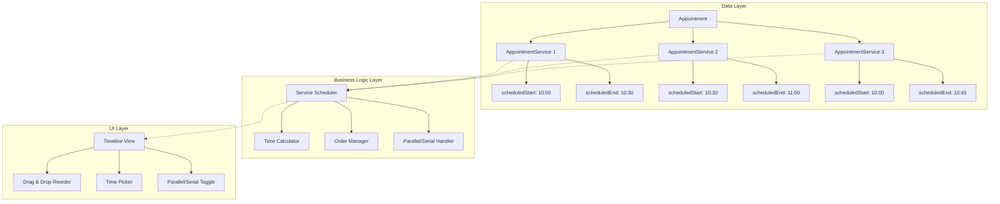
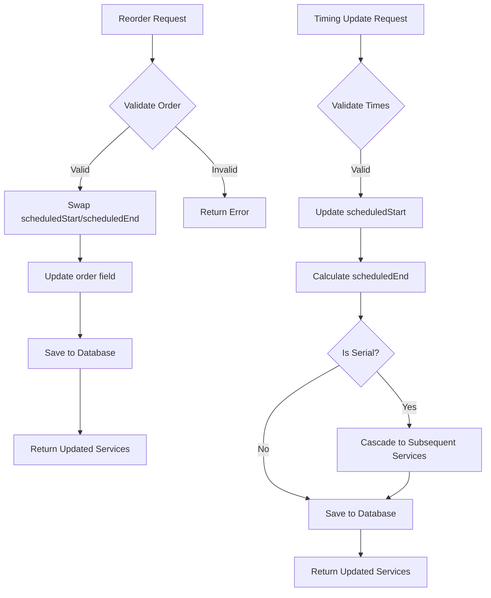
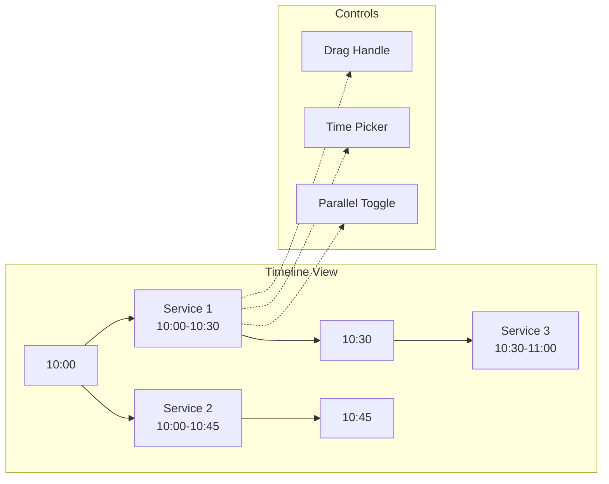
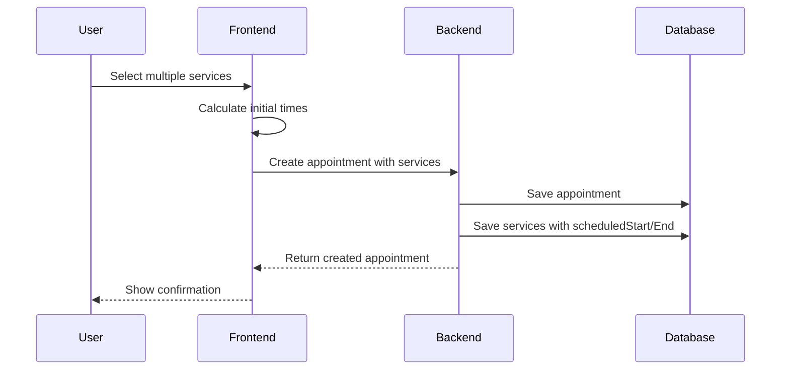
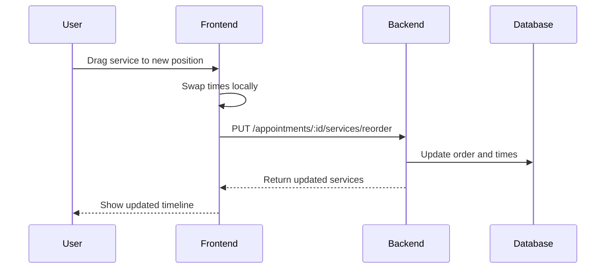

# Multi-Service Appointments Improvement Plan

## Overview

This plan outlines improvements to the multi-service appointment system to make it easier to:
- Change the order of services
- Modify the starting time of individual services
- Switch between parallel and serial execution modes
- Support mixed parallel/serial configurations

## Current State Analysis

### Current Implementation
- Services can have `scheduledStart` and `scheduledEnd` if explicitly set
- Otherwise, times are calculated based on order and duration
- Services can be parallel (`isParallel: true`) or serial
- Reordering requires manual time recalculation

### Pain Points
1. **Hidden calculations**: Times are calculated on-the-fly if not stored
2. **Difficult reordering**: Changing order requires complex recalculation
3. **Inflexible timing**: Hard to adjust individual service start times
4. **Limited parallel/serial control**: No easy way to mix modes

## Proposed Solution

### Core Principle
**Always store explicit `scheduledStart` and `scheduledEnd` for each service**, rather than relying on calculation.

### Benefits
1. **Easy reordering**: Swap times between services
2. **Easy time changes**: Directly modify start times
3. **Easy parallel/serial changes**: Adjust times to overlap or sequence
4. **Predictable behavior**: No hidden calculations
5. **Better performance**: No runtime calculations needed

## Architecture



## Implementation Plan

### Phase 1: Data Model Updates

#### 1.1 Update AppointmentService Schema
```typescript
interface AppointmentService {
  id: string;
  appointmentId: string;
  serviceId: string;
  professionalId?: string;
  scheduledStart: string;  // ISO timestamp - REQUIRED
  scheduledEnd: string;    // ISO timestamp - REQUIRED
  isParallel: boolean;
  order: number;
  status: 'pending' | 'active' | 'processing' | 'completed' | 'cancelled';
}
```

#### 1.2 Migration Strategy
- Add `scheduledStart` and `scheduledEnd` to existing records
- Calculate times based on current logic
- Set default values for missing data

### Phase 2: Backend API Updates

#### 2.1 New Endpoints

```typescript
// Reorder services
PUT /appointments/:id/services/reorder
Body: { serviceOrders: [{ serviceId, order }] }

// Update service timing
PUT /appointment-services/:id/timing
Body: { scheduledStart, scheduledEnd }

// Toggle parallel/serial mode
PUT /appointment-services/:id/mode
Body: { isParallel: boolean }
```

#### 2.2 Business Logic



### Phase 3: Frontend UI Updates

#### 3.1 Timeline View Component



#### 3.2 Key UI Features

1. **Timeline Visualization**
   - Visual representation of service times
   - Color-coded parallel vs serial services
   - Drag handles for reordering

2. **Time Picker**
   - Select start time for each service
   - Auto-calculate end time based on duration
   - Validation for overlapping times

3. **Parallel/Serial Toggle**
   - Switch individual services between modes
   - Visual indicator of current mode
   - Auto-adjust times when toggling

4. **Reorder Controls**
   - Drag and drop to change order
   - Visual feedback during drag
   - Auto-swap times when reordering

### Phase 4: Integration

#### 4.1 Appointment Creation Flow



#### 4.2 Service Reordering Flow



## Testing Strategy

### Unit Tests
- Time calculation logic
- Order validation
- Parallel/serial mode toggling
- Cascade updates for serial services

### Integration Tests
- API endpoint functionality
- Database operations
- Frontend-backend communication

### E2E Tests
- Complete reordering workflow
- Time adjustment workflow
- Mode switching workflow

## Rollout Plan

### Phase 1 (Week 1-2)
- Database schema updates
- Migration scripts
- Backend API updates

### Phase 2 (Week 3-4)
- Frontend timeline component
- Drag-and-drop functionality
- Time picker integration

### Phase 3 (Week 5-6)
- Parallel/serial toggle
- Testing and bug fixes
- Documentation

### Phase 4 (Week 7-8)
- User acceptance testing
- Performance optimization
- Production deployment

## Success Metrics

1. **User Experience**
   - Time to reorder services: < 5 seconds
   - Time to adjust service time: < 3 seconds
   - User satisfaction score: > 4.5/5

2. **Performance**
   - API response time: < 200ms
   - UI update time: < 100ms
   - Database query time: < 50ms

3. **Reliability**
   - Data consistency: 100%
   - Error rate: < 0.1%
   - Uptime: > 99.9%

## Risks and Mitigations

| Risk | Impact | Mitigation |
|------|--------|------------|
| Data migration issues | High | Comprehensive testing, rollback plan |
| Performance degradation | Medium | Caching, optimization, monitoring |
| User confusion | Medium | Clear UI, documentation, training |
| Integration conflicts | Low | Incremental rollout, feature flags |

## Future Enhancements

1. **Smart Scheduling**: AI-powered optimal time suggestions
2. **Conflict Detection**: Automatic detection of scheduling conflicts
3. **Template System**: Save and reuse common service combinations
4. **Batch Operations**: Reorder multiple appointments at once
5. **Mobile Support**: Touch-optimized timeline view
