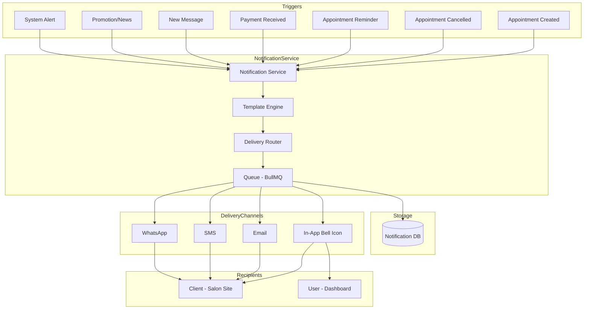

# Notification System Implementation Plan (Revised)

> **🎉 IMPLEMENTATION COMPLETE**
>
> All planned features have been successfully implemented. The notification system is now fully operational with in-app notifications, email/SMS integration, real-time updates via WebSocket, and automated reminder scheduling.
>
> **Completed**: February 2026

## Overview

This document outlines the architecture and implementation plan for a comprehensive notification system in KiraRoom. The system will support two main contexts:

1. **Salon Site (Client-facing)**: Notifications for clients about appointments, promotions, and news
2. **Dashboard (Admin/Staff)**: Notifications for professionals and admins about business events

## Architecture Analysis

### Current System
- **Multi-tenant architecture** with Tenant model
- **User types**: User (staff/admin), Client (booking customers)
- **Existing notification preferences** in Client model: `communicationPreferences` JSON field
- **User preferences** in User model: `preferences` JSON field

### Notification Flow Diagram



## Database Schema Design

### New Models to Add

```prisma
model Notification {
  id          String             @id @default(uuid())
  createdAt   DateTime           @default(now())
  updatedAt   DateTime           @updatedAt
  tenantId    String
  
  // Recipient - can be either User or Client
  userId      String?
  clientId    String?
  
  // Notification content
  type        NotificationType
  title       String
  message     String
  data        Json               @default("{}")  // Typed data for deep linking
  
  // Status
  isRead      Boolean            @default(false)
  readAt      DateTime?
  
  // Soft delete / Archive
  archivedAt  DateTime?
  
  // Relations
  user        User?              @relation(fields: [userId], references: [id], onDelete: Cascade)
  client      Client?            @relation(fields: [clientId], references: [id], onDelete: Cascade)
  tenant      Tenant             @relation(fields: [tenantId], references: [id], onDelete: Cascade)
  deliveries  NotificationDelivery[]

  @@index([tenantId])
  @@index([userId])
  @@index([clientId])
  @@index([tenantId, isRead])
  @@index([archivedAt])
  @@map("notifications")
}

model NotificationDelivery {
  id             String       @id @default(uuid())
  createdAt      DateTime     @default(now())
  notificationId String
  
  // Channel information
  channel        String       // "email" | "sms" | "whatsapp" | "inApp"
  status         String       // "pending" | "sent" | "delivered" | "failed"
  
  // External tracking
  externalId     String?      // Twilio/SendGrid message ID for webhooks
  error          String?      // Error message if failed
  
  // Timestamps
  sentAt         DateTime?
  deliveredAt    DateTime?
  
  // Relations
  notification   Notification @relation(fields: [notificationId], references: [id], onDelete: Cascade)

  @@index([notificationId])
  @@index([channel, status])
  @@map("notification_deliveries")
}

model NotificationTemplate {
  id          String             @id @default(uuid())
  createdAt   DateTime           @default(now())
  updatedAt   DateTime           @updatedAt
  tenantId    String
  
  // Template identification
  type        NotificationType
  slug        String             // e.g., "appointment_reminder_24h", "appointment_reminder_1h"
  name        String
  description String?
  
  // Content templates
  titleTemplate    String       // Supports variables like {{clientName}}
  messageTemplate  String
  
  // Channel-specific templates
  emailSubject     String?
  emailBody        String?      // HTML template
  smsTemplate      String?
  whatsappTemplate String?
  
  // Settings
  isActive    Boolean            @default(true)
  
  // Relations
  tenant      Tenant             @relation(fields: [tenantId], references: [id], onDelete: Cascade)

  @@unique([tenantId, type, slug])
  @@map("notification_templates")
}

model NotificationPreference {
  id          String             @id @default(uuid())
  createdAt   DateTime           @default(now())
  updatedAt   DateTime           @updatedAt
  tenantId    String
  
  // Recipient
  userId      String?
  clientId    String?
  
  // Channel preferences per notification type
  preferences Json               @default("{}")
  // Example: { "appointment_reminder": { "inApp": true, "email": true, "sms": false, "whatsapp": false } }
  
  // Relations
  user        User?              @relation(fields: [userId], references: [id], onDelete: Cascade)
  client      Client?            @relation(fields: [clientId], references: [id], onDelete: Cascade)
  tenant      Tenant             @relation(fields: [tenantId], references: [id], onDelete: Cascade)

  @@unique([tenantId, userId])
  @@unique([tenantId, clientId])
  @@map("notification_preferences")
}

enum NotificationType {
  // Appointment related
  appointment_created
  appointment_confirmed
  appointment_cancelled
  appointment_reminder_24h
  appointment_reminder_1h
  appointment_completed
  review_request
  
  // Payment related
  payment_received
  payment_failed
  refund_processed
  
  // Promotional
  promotion
  news
  special_offer
  
  // System
  system_alert
  account_update
  password_change
  
  // Professional specific
  new_appointment_assigned
  schedule_change
  new_message
}
```

### Update Existing Models

Add relations to existing models:

```prisma
model User {
  // ... existing fields ...
  notifications         Notification[]
  notificationPreference NotificationPreference?
}

model Client {
  // ... existing fields ...
  notifications         Notification[]
  notificationPreference NotificationPreference?
}

model Tenant {
  // ... existing fields ...
  notifications         Notification[]
  notificationTemplates NotificationTemplate[]
  notificationPreferences NotificationPreference[]
}
```

## Notification Data Schema Contract

The `data` JSON field has a defined shape per notification type:

```typescript
// Shared types for frontend and backend

interface BaseNotificationData {
  tenantId: string;
}

// Appointment notifications
interface AppointmentCreatedData extends BaseNotificationData {
  appointmentId: string;
  serviceId: string;
  serviceName: string;
  professionalId: string;
  professionalName: string;
  date: string;
  time: string;
}

interface AppointmentReminderData extends BaseNotificationData {
  appointmentId: string;
  serviceId: string;
  serviceName: string;
  professionalName: string;
  date: string;
  time: string;
  hoursUntil: number; // 24 or 1
}

interface AppointmentCancelledData extends BaseNotificationData {
  appointmentId: string;
  serviceName: string;
  date: string;
  time: string;
  reason?: string;
}

interface ReviewRequestData extends BaseNotificationData {
  appointmentId: string;
  serviceId: string;
  serviceName: string;
  professionalId: string;
  professionalName: string;
}

// Payment notifications
interface PaymentReceivedData extends BaseNotificationData {
  paymentId: string;
  appointmentId: string;
  amount: number;
  currency: string;
}

// Promotional notifications
interface PromotionData extends BaseNotificationData {
  promotionId: string;
  code?: string;
  discount?: string;
  validUntil?: string;
}

// Professional notifications
interface NewAppointmentAssignedData extends BaseNotificationData {
  appointmentId: string;
  clientId: string;
  clientName: string;
  serviceName: string;
  date: string;
  time: string;
}
```

## Default Preference Behavior

When no `NotificationPreference` record exists for a user/client, the system defaults to:

```typescript
const DEFAULT_PREFERENCES = {
  appointment_created: { inApp: true, email: true, sms: false, whatsapp: false },
  appointment_confirmed: { inApp: true, email: true, sms: true, whatsapp: false },
  appointment_cancelled: { inApp: true, email: true, sms: true, whatsapp: false },
  appointment_reminder_24h: { inApp: true, email: true, sms: true, whatsapp: false },
  appointment_reminder_1h: { inApp: true, email: false, sms: true, whatsapp: false },
  appointment_completed: { inApp: true, email: true, sms: false, whatsapp: false },
  review_request: { inApp: true, email: true, sms: false, whatsapp: false },
  payment_received: { inApp: true, email: true, sms: false, whatsapp: false },
  payment_failed: { inApp: true, email: true, sms: true, whatsapp: false },
  promotion: { inApp: true, email: true, sms: false, whatsapp: false },
  news: { inApp: true, email: true, sms: false, whatsapp: false },
  special_offer: { inApp: true, email: true, sms: false, whatsapp: false },
  system_alert: { inApp: true, email: true, sms: false, whatsapp: false },
  new_appointment_assigned: { inApp: true, email: true, sms: false, whatsapp: false },
  schedule_change: { inApp: true, email: true, sms: false, whatsapp: false },
  new_message: { inApp: true, email: false, sms: false, whatsapp: false },
};
```

## Backend Implementation

### Module Structure

```
packages/backend/src/notifications/
├── notifications.module.ts
├── notifications.controller.ts
├── notifications.service.ts
├── notifications.queue.ts          # BullMQ queue definitions
├── notifications.processor.ts      # Queue job processors
├── notifications.gateway.ts        # WebSocket gateway for real-time
├── dto/
│   ├── create-notification.dto.ts
│   ├── update-notification.dto.ts
│   ├── notification-filter.dto.ts
│   └── notification-preference.dto.ts
├── templates/
│   └── default-templates.ts
├── interfaces/
│   └── notification.interface.ts
└── types/
    └── notification-data.types.ts  # Shared data types
```

### Queue Interface (BullMQ)

```typescript
// notifications.queue.ts
import { Queue } from 'bullmq';

export const NOTIFICATION_QUEUE = 'notifications';

export interface NotificationJobData {
  notificationId: string;
  channels: string[];
  recipient: {
    type: 'user' | 'client';
    id: string;
    email?: string;
    phone?: string;
  };
}

export class NotificationQueue {
  private queue: Queue;

  constructor() {
    this.queue = new Queue(NOTIFICATION_QUEUE, {
      connection: {
        host: process.env.REDIS_HOST,
        port: parseInt(process.env.REDIS_PORT || '6379'),
      },
    });
  }

  async addDeliveryJob(data: NotificationJobData) {
    await this.queue.add('deliver', data, {
      attempts: 3,
      backoff: {
        type: 'exponential',
        delay: 1000,
      },
    });
  }

  async addBulkDeliveryJobs(jobs: NotificationJobData[]) {
    await this.queue.addBulk(
      jobs.map(data => ({
        name: 'deliver',
        data,
        opts: {
          attempts: 3,
          backoff: { type: 'exponential', delay: 1000 },
        },
      }))
    );
  }
}
```

### API Endpoints

#### Dashboard API (Authenticated Users)

| Method | Endpoint | Description |
|--------|----------|-------------|
| GET | `/notifications` | Get all notifications for current user (paginated) |
| GET | `/notifications/unread-count` | Get unread notifications count |
| PUT | `/notifications/:id/read` | Mark notification as read |
| PUT | `/notifications/read-all` | Mark all notifications as read |
| DELETE | `/notifications/:id` | Archive a notification (soft delete) |
| GET | `/notifications/preferences` | Get notification preferences |
| PUT | `/notifications/preferences` | Update notification preferences |

#### Salon Site API (Clients)

| Method | Endpoint | Description |
|--------|----------|-------------|
| GET | `/client/notifications` | Get all notifications for current client (paginated) |
| GET | `/client/notifications/unread-count` | Get unread notifications count |
| PUT | `/client/notifications/:id/read` | Mark notification as read |
| PUT | `/client/notifications/read-all` | Mark all notifications as read |
| DELETE | `/client/notifications/:id` | Archive a notification (soft delete) |

### Notification Service Interface

```typescript
interface NotificationService {
  // Create notification (persists to DB first, then enqueues delivery)
  create(data: CreateNotificationDto): Promise<Notification>;
  
  // Queue delivery jobs (called after create)
  enqueueDelivery(notification: Notification, channels: string[]): Promise<void>;
  
  // Send to specific channels (called by queue processor)
  sendToInApp(notification: Notification): Promise<NotificationDelivery>;
  sendEmail(notification: Notification, email: string): Promise<NotificationDelivery>;
  sendSms(notification: Notification, phone: string): Promise<NotificationDelivery>;
  sendWhatsApp(notification: Notification, phone: string): Promise<NotificationDelivery>;
  
  // Bulk operations (uses queue)
  sendBulk(notifications: Notification[]): Promise<void>;
  sendToAllClients(tenantId: string, notification: Partial<Notification>): Promise<void>;
  
  // Template processing
  processTemplate(template: string, data: Record<string, any>): string;
  
  // Preferences
  getPreferences(userId: string): Promise<NotificationPreference>;
  getDefaultPreferences(): Record<string, ChannelPreferences>;
}
```

## WebSocket Authentication

### Dashboard (Users)
- Authenticated via JWT in connection handshake
- User ID extracted from JWT payload
- Joined to tenant-specific room

### Salon Site (Clients)
- Authenticated via JWT stored in localStorage
- JWT passed in WebSocket connection query or headers
- Client ID extracted from JWT payload
- Joined to client-specific room

```typescript
// notifications.gateway.ts
@WebSocketGateway({
  cors: { origin: '*' },
  namespace: '/notifications',
})
export class NotificationsGateway implements OnGatewayConnection {
  handleConnection(client: Socket) {
    const token = client.handshake.auth.token || client.handshake.query.token;
    const payload = this.jwtService.verify(token);
    
    if (payload.userId) {
      client.join(`user:${payload.userId}`);
      client.join(`tenant:${payload.tenantId}`);
    } else if (payload.clientId) {
      client.join(`client:${payload.clientId}`);
    }
  }
}
```

## Notification Retention Policy

- **Active notifications**: Kept indefinitely until archived by user
- **Archived notifications**: Soft-deleted with `archivedAt` timestamp
- **Auto-cleanup**: Cron job runs daily to permanently delete archived notifications older than 90 days

```typescript
// Cron job in notifications.service.ts
@Cron('0 3 * * *') // 3 AM daily
async cleanupOldNotifications() {
  const ninetyDaysAgo = new Date();
  ninetyDaysAgo.setDate(ninetyDaysAgo.getDate() - 90);
  
  await this.prisma.notification.deleteMany({
    where: {
      archivedAt: { lt: ninetyDaysAgo },
    },
  });
}
```

## Frontend Implementation

### Dashboard Notification Component

Location: `packages/frontend/app/dashboard/components/notification-bell.tsx`

Features:
- Bell icon with unread count badge
- Dropdown panel with notification list
- Mark as read functionality
- Click to navigate to related content
- Real-time updates via WebSocket

### Salon Site Notification Component

Location: `packages/frontend/app/sites/[salonName]/account/components/notifications.tsx`

Features:
- Bell icon in navigation bar
- Notification panel in account area
- Appointment reminders
- Promotional notifications
- News updates

### UI Components

```tsx
// Notification Bell Component
<NotificationBell>
  <BellIcon />
  <UnreadCountBadge count={unreadCount} />
  <NotificationDropdown>
    <NotificationList notifications={notifications} />
    <MarkAllReadButton />
  </NotificationDropdown>
</NotificationBell>

// Notification Item
<NotificationItem notification={notification}>
  <NotificationIcon type={notification.type} />
  <NotificationContent>
    <Title>{notification.title}</Title>
    <Message>{notification.message}</Message>
    <Timestamp>{formatTime(notification.createdAt)}</Timestamp>
  </NotificationContent>
  <MarkAsReadButton />
</NotificationItem>
```

## Notification Triggers

### Automatic Triggers

| Event | Notification Type | Recipients | Channels |
|-------|-------------------|------------|----------|
| Appointment created | `appointment_created` | Client, Professional, Admin | In-App, Email |
| Appointment confirmed | `appointment_confirmed` | Client, Professional | In-App, Email, SMS |
| Appointment cancelled | `appointment_cancelled` | Client, Professional, Admin | In-App, Email |
| 24h before appointment | `appointment_reminder_24h` | Client, Professional | In-App, Email, SMS, WhatsApp |
| 1h before appointment | `appointment_reminder_1h` | Client, Professional | In-App, SMS |
| Appointment completed | `appointment_completed` | Client, Professional, Admin | In-App, Email |
| 2h after completion | `review_request` | Client | In-App, Email |
| Payment received | `payment_received` | Client, Admin | In-App, Email |
| New appointment assigned | `new_appointment_assigned` | Professional | In-App, Email |
| Schedule change | `schedule_change` | Professional | In-App, Email |

### Manual Triggers (Admin)

| Action | Notification Type | Recipients | Channels |
|--------|-------------------|------------|----------|
| Send promotion | `promotion` | All Clients | In-App, Email |
| Send news | `news` | All Clients | In-App, Email |
| Send special offer | `special_offer` | Selected Clients | In-App, Email, SMS |
| System alert | `system_alert` | All Users | In-App, Email |

## Implementation Phases

### Phase 1: Core Infrastructure ✅ COMPLETE
- [x] Add database schema for notifications
- [x] Create notification module in backend
- [x] Implement basic CRUD operations
- [x] Create notification service
- [x] Set up BullMQ queue interface (stub for now)
- [x] Define shared notification data types

### Phase 2: Dashboard Notifications ✅ COMPLETE
- [x] Build notification bell component
- [x] Create notification dropdown
- [x] Implement mark as read functionality
- [x] Add notification preferences page
- [x] Implement soft delete (archive)

### Phase 3: Salon Site Notifications ✅ COMPLETE
- [x] Add notification bell to salon site navigation
- [x] Create notification list page
- [x] Implement client notification preferences
- [x] Add notification settings to settings page

### Phase 4: Email/SMS Integration ✅ COMPLETE
- [x] Integrate email service (SendGrid/Resend)
- [x] Integrate SMS service (Twilio)
- [x] Create email templates
- [x] Create SMS templates
- [x] Implement delivery tracking via webhooks

### Phase 5: Real-time Updates ✅ COMPLETE
- [x] Implement WebSocket gateway
- [x] Add real-time notification delivery
- [x] Handle connection management
- [x] Implement JWT authentication for WebSocket

### Phase 6: Automation ✅ COMPLETE
- [x] Implement appointment reminder cron jobs
- [x] Add notification triggers to appointment service
- [x] Create admin notification broadcast feature
- [x] Implement notification cleanup cron job

## Technical Considerations

### Performance
- Use pagination for notification lists (20 per page)
- Implement notification archiving for old notifications
- Use Redis for notification caching and queue management
- Queue all bulk operations

### Security
- Validate recipient ownership
- Sanitize notification content
- Rate limit notification creation
- Verify JWT for WebSocket connections

### Scalability
- Use BullMQ for all notification delivery
- Consider using a dedicated notification microservice for large scale
- Implement connection pooling for WebSocket

## Next Steps

1. Review and approve this revised plan
2. Start with Phase 1: Database schema and backend module
3. Proceed to frontend components
4. Add email/SMS integrations
5. Implement automation features

---

# Detailed Implementation Specifications

This section provides comprehensive implementation details for the remaining phases.

---

## Phase 4: Email/SMS Integration - Detailed Implementation

### 4.1 Email Service Setup

#### Required NPM Packages

```bash
# Option A: Using Resend (recommended for modern apps)
npm install resend

# Option B: Using SendGrid
npm install @sendgrid/mail

# Shared dependencies
npm install @nestjs/config handlebars
```

#### Environment Variables

Add to `packages/backend/.env`:

```env
# Email Service Configuration
EMAIL_PROVIDER=resend  # or 'sendgrid'
RESEND_API_KEY=re_xxxxxxxxxxxx
SENDGRID_API_KEY=SG.xxxxxxxxxxxx
EMAIL_FROM_ADDRESS=noreply@kiraroom.com
EMAIL_FROM_NAME=KiraRoom

# Public URL for email links
PUBLIC_BASE_URL=https://kiraroom.com
```

#### Email Service Class Structure

Create `packages/backend/src/notifications/services/email.service.ts`:

```typescript
import { Injectable, Logger } from '@nestjs/common';
import { ConfigService } from '@nestjs/config';
import { Resend } from 'resend';
import * as SendGrid from '@sendgrid/mail';
import { Notification } from '@prisma/client';

export interface EmailOptions {
  to: string;
  subject: string;
  html: string;
  text?: string;
  replyTo?: string;
  attachments?: Array<{
    filename: string;
    content: Buffer | string;
    contentType: string;
  }>;
}

@Injectable()
export class EmailService {
  private readonly logger = new Logger(EmailService.name);
  private resend: Resend | null = null;
  private sendgridConfigured = false;

  constructor(private configService: ConfigService) {
    this.initializeProvider();
  }

  private initializeProvider() {
    const provider = this.configService.get('EMAIL_PROVIDER');
    
    if (provider === 'resend') {
      const apiKey = this.configService.get('RESEND_API_KEY');
      if (apiKey) {
        this.resend = new Resend(apiKey);
        this.logger.log('Resend email provider initialized');
      }
    } else if (provider === 'sendgrid') {
      const apiKey = this.configService.get('SENDGRID_API_KEY');
      if (apiKey) {
        SendGrid.setApiKey(apiKey);
        this.sendgridConfigured = true;
        this.logger.log('SendGrid email provider initialized');
      }
    }
  }

  async send(options: EmailOptions): Promise<{ success: boolean; messageId?: string; error?: string }> {
    const from = {
      email: this.configService.get('EMAIL_FROM_ADDRESS') || 'noreply@kiraroom.com',
      name: this.configService.get('EMAIL_FROM_NAME') || 'KiraRoom',
    };

    try {
      if (this.resend) {
        const { data, error } = await this.resend.emails.send({
          from: `${from.name} <${from.email}>`,
          to: options.to,
          subject: options.subject,
          html: options.html,
          text: options.text,
          reply_to: options.replyTo,
        });

        if (error) {
          return { success: false, error: error.message };
        }
        return { success: true, messageId: data?.id };
      }

      if (this.sendgridConfigured) {
        const response = await SendGrid.send({
          from: { email: from.email, name: from.name },
          to: options.to,
          subject: options.subject,
          html: options.html,
          text: options.text,
          replyTo: options.replyTo,
        });
        return { success: true, messageId: response[0]?.headers?.['x-message-id'] };
      }

      return { success: false, error: 'No email provider configured' };
    } catch (error) {
      this.logger.error(`Failed to send email: ${error.message}`);
      return { success: false, error: error.message };
    }
  }

  // Convenience methods for common notification types
  async sendAppointmentConfirmation(email: string, data: AppointmentEmailData): Promise<void> {
    const html = this.renderTemplate('appointment-confirmation', data);
    await this.send({
      to: email,
      subject: `Appointment Confirmed - ${data.serviceName} on ${data.date}`,
      html,
    });
  }

  async sendAppointmentReminder(email: string, data: ReminderEmailData): Promise<void> {
    const html = this.renderTemplate('appointment-reminder', data);
    const subject = data.hoursUntil === 24 
      ? `Reminder: Your appointment tomorrow at ${data.time}`
      : `Reminder: Your appointment in 1 hour`;
    await this.send({ to: email, subject, html });
  }

  async sendAppointmentCancellation(email: string, data: CancellationEmailData): Promise<void> {
    const html = this.renderTemplate('appointment-cancellation', data);
    await this.send({
      to: email,
      subject: `Appointment Cancelled - ${data.serviceName}`,
      html,
    });
  }

  async sendAppointmentRescheduled(email: string, data: RescheduleEmailData): Promise<void> {
    const html = this.renderTemplate('appointment-rescheduled', data);
    await this.send({
      to: email,
      subject: `Appointment Rescheduled - ${data.serviceName} on ${data.newDate}`,
      html,
    });
  }

  private renderTemplate(templateName: string, data: Record<string, any>): string {
    // Template rendering logic - see Email Templates section below
    return this.templateEngine.render(templateName, data);
  }
}
```

#### HTML Email Templates

Create `packages/backend/src/notifications/templates/emails/`:

**appointment-confirmation.hbs:**
```html
<!DOCTYPE html>
<html>
<head>
  <meta charset="utf-8">
  <meta name="viewport" content="width=device-width, initial-scale=1.0">
  <title>Appointment Confirmed</title>
</head>
<body style="font-family: -apple-system, BlinkMacSystemFont, 'Segoe UI', Roboto, sans-serif; max-width: 600px; margin: 0 auto; padding: 20px; background-color: #f9fafb;">
  <div style="background: white; border-radius: 12px; padding: 32px; box-shadow: 0 1px 3px rgba(0,0,0,0.1);">
    <h1 style="color: #059669; margin: 0 0 24px; font-size: 24px;">✓ Appointment Confirmed</h1>
    
    <p style="color: #374151; font-size: 16px; margin-bottom: 24px;">
      Hi {{clientName}}, your appointment has been confirmed!
    </p>
    
    <div style="background: #f3f4f6; border-radius: 8px; padding: 20px; margin-bottom: 24px;">
      <table style="width: 100%; border-collapse: collapse;">
        <tr>
          <td style="padding: 8px 0; color: #6b7280;">Service:</td>
          <td style="padding: 8px 0; color: #111827; font-weight: 600;">{{serviceName}}</td>
        </tr>
        <tr>
          <td style="padding: 8px 0; color: #6b7280;">Professional:</td>
          <td style="padding: 8px 0; color: #111827; font-weight: 600;">{{professionalName}}</td>
        </tr>
        <tr>
          <td style="padding: 8px 0; color: #6b7280;">Date:</td>
          <td style="padding: 8px 0; color: #111827; font-weight: 600;">{{date}}</td>
        </tr>
        <tr>
          <td style="padding: 8px 0; color: #6b7280;">Time:</td>
          <td style="padding: 8px 0; color: #111827; font-weight: 600;">{{time}}</td>
        </tr>
        <tr>
          <td style="padding: 8px 0; color: #6b7280;">Duration:</td>
          <td style="padding: 8px 0; color: #111827; font-weight: 600;">{{duration}} minutes</td>
        </tr>
        {{#if price}}
        <tr>
          <td style="padding: 8px 0; color: #6b7280;">Price:</td>
          <td style="padding: 8px 0; color: #111827; font-weight: 600;">{{price}}</td>
        </tr>
        {{/if}}
      </table>
    </div>
    
    <div style="text-align: center; margin-bottom: 24px;">
      <a href="{{salonUrl}}/account/appointments/{{appointmentId}}" 
         style="display: inline-block; background: #059669; color: white; padding: 12px 24px; border-radius: 8px; text-decoration: none; font-weight: 600;">
        View Appointment Details
      </a>
    </div>
    
    <p style="color: #6b7280; font-size: 14px; margin: 0;">
      Need to reschedule or cancel? Please do so at least 24 hours in advance.
    </p>
  </div>
  
  <div style="text-align: center; margin-top: 24px; color: #9ca3af; font-size: 12px;">
    <p>{{salonName}} • {{salonAddress}}</p>
  </div>
</body>
</html>
```

**appointment-reminder.hbs:**
```html
<!DOCTYPE html>
<html>
<head>
  <meta charset="utf-8">
  <title>Appointment Reminder</title>
</head>
<body style="font-family: -apple-system, BlinkMacSystemFont, 'Segoe UI', Roboto, sans-serif; max-width: 600px; margin: 0 auto; padding: 20px; background-color: #f9fafb;">
  <div style="background: white; border-radius: 12px; padding: 32px; box-shadow: 0 1px 3px rgba(0,0,0,0.1);">
    {{#if is24Hour}}
    <h1 style="color: #d97706; margin: 0 0 24px; font-size: 24px;">📅 Appointment Tomorrow</h1>
    {{else}}
    <h1 style="color: #dc2626; margin: 0 0 24px; font-size: 24px;">⏰ Appointment in 1 Hour!</h1>
    {{/if}}
    
    <p style="color: #374151; font-size: 16px; margin-bottom: 24px;">
      Hi {{clientName}}, this is a reminder for your upcoming appointment.
    </p>
    
    <div style="background: {{#if is24Hour}}#fffbeb{{else}}#fef2f2{{/if}}; border-radius: 8px; padding: 20px; margin-bottom: 24px; border-left: 4px solid {{#if is24Hour}}#d97706{{else}}#dc2626{{/if}};">
      <table style="width: 100%; border-collapse: collapse;">
        <tr>
          <td style="padding: 8px 0; color: #6b7280;">Service:</td>
          <td style="padding: 8px 0; color: #111827; font-weight: 600;">{{serviceName}}</td>
        </tr>
        <tr>
          <td style="padding: 8px 0; color: #6b7280;">With:</td>
          <td style="padding: 8px 0; color: #111827; font-weight: 600;">{{professionalName}}</td>
        </tr>
        <tr>
          <td style="padding: 8px 0; color: #6b7280;">Time:</td>
          <td style="padding: 8px 0; color: #111827; font-weight: 600; font-size: 18px;">{{time}}</td>
        </tr>
        <tr>
          <td style="padding: 8px 0; color: #6b7280;">Location:</td>
          <td style="padding: 8px 0; color: #111827;">{{salonAddress}}</td>
        </tr>
      </table>
    </div>
    
    {{#if is24Hour}}
    <p style="color: #6b7280; font-size: 14px; margin-bottom: 16px;">
      Please arrive 5-10 minutes early. We look forward to seeing you!
    </p>
    {{else}}
    <p style="color: #dc2626; font-size: 16px; font-weight: 600; margin-bottom: 16px;">
      Please head to the salon now if you haven't already!
    </p>
    {{/if}}
    
    <div style="text-align: center;">
      <a href="{{mapLink}}" style="display: inline-block; background: #374151; color: white; padding: 12px 24px; border-radius: 8px; text-decoration: none; font-weight: 600; margin-right: 8px;">
        Get Directions
      </a>
    </div>
  </div>
</body>
</html>
```

**appointment-cancellation.hbs:**
```html
<!DOCTYPE html>
<html>
<head>
  <meta charset="utf-8">
  <title>Appointment Cancelled</title>
</head>
<body style="font-family: -apple-system, BlinkMacSystemFont, 'Segoe UI', Roboto, sans-serif; max-width: 600px; margin: 0 auto; padding: 20px; background-color: #f9fafb;">
  <div style="background: white; border-radius: 12px; padding: 32px; box-shadow: 0 1px 3px rgba(0,0,0,0.1);">
    <h1 style="color: #dc2626; margin: 0 0 24px; font-size: 24px;">❌ Appointment Cancelled</h1>
    
    <p style="color: #374151; font-size: 16px; margin-bottom: 24px;">
      Hi {{clientName}}, your appointment has been cancelled.
    </p>
    
    <div style="background: #fef2f2; border-radius: 8px; padding: 20px; margin-bottom: 24px;">
      <table style="width: 100%; border-collapse: collapse;">
        <tr>
          <td style="padding: 8px 0; color: #6b7280;">Service:</td>
          <td style="padding: 8px 0; color: #111827; font-weight: 600;">{{serviceName}}</td>
        </tr>
        <tr>
          <td style="padding: 8px 0; color: #6b7280;">Was scheduled:</td>
          <td style="padding: 8px 0; color: #111827;">{{date}} at {{time}}</td>
        </tr>
        {{#if reason}}
        <tr>
          <td style="padding: 8px 0; color: #6b7280;">Reason:</td>
          <td style="padding: 8px 0; color: #111827;">{{reason}}</td>
        </tr>
        {{/if}}
      </table>
    </div>
    
    <div style="text-align: center; margin-bottom: 24px;">
      <a href="{{salonUrl}}/book" 
         style="display: inline-block; background: #059669; color: white; padding: 12px 24px; border-radius: 8px; text-decoration: none; font-weight: 600;">
        Book a New Appointment
      </a>
    </div>
    
    <p style="color: #6b7280; font-size: 14px; margin: 0;">
      If you didn't request this cancellation, please contact us at {{salonPhone}}.
    </p>
  </div>
</body>
</html>
```

**appointment-rescheduled.hbs:**
```html
<!DOCTYPE html>
<html>
<head>
  <meta charset="utf-8">
  <title>Appointment Rescheduled</title>
</head>
<body style="font-family: -apple-system, BlinkMacSystemFont, 'Segoe UI', Roboto, sans-serif; max-width: 600px; margin: 0 auto; padding: 20px; background-color: #f9fafb;">
  <div style="background: white; border-radius: 12px; padding: 32px; box-shadow: 0 1px 3px rgba(0,0,0,0.1);">
    <h1 style="color: #2563eb; margin: 0 0 24px; font-size: 24px;">🔄 Appointment Rescheduled</h1>
    
    <p style="color: #374151; font-size: 16px; margin-bottom: 24px;">
      Hi {{clientName}}, your appointment has been rescheduled.
    </p>
    
    <div style="background: #eff6ff; border-radius: 8px; padding: 20px; margin-bottom: 24px;">
      <h3 style="color: #6b7280; font-size: 12px; text-transform: uppercase; margin: 0 0 12px;">Previous</h3>
      <p style="margin: 0 0 16px; color: #9ca3af; text-decoration: line-through;">
        {{oldDate}} at {{oldTime}}
      </p>
      
      <h3 style="color: #6b7280; font-size: 12px; text-transform: uppercase; margin: 0 0 12px;">New Schedule</h3>
      <table style="width: 100%; border-collapse: collapse;">
        <tr>
          <td style="padding: 8px 0; color: #6b7280;">Service:</td>
          <td style="padding: 8px 0; color: #111827; font-weight: 600;">{{serviceName}}</td>
        </tr>
        <tr>
          <td style="padding: 8px 0; color: #6b7280;">Date:</td>
          <td style="padding: 8px 0; color: #111827; font-weight: 600;">{{newDate}}</td>
        </tr>
        <tr>
          <td style="padding: 8px 0; color: #6b7280;">Time:</td>
          <td style="padding: 8px 0; color: #111827; font-weight: 600;">{{newTime}}</td>
        </tr>
        <tr>
          <td style="padding: 8px 0; color: #6b7280;">With:</td>
          <td style="padding: 8px 0; color: #111827;">{{professionalName}}</td>
        </tr>
      </table>
    </div>
    
    <div style="text-align: center;">
      <a href="{{salonUrl}}/account/appointments/{{appointmentId}}" 
         style="display: inline-block; background: #2563eb; color: white; padding: 12px 24px; border-radius: 8px; text-decoration: none; font-weight: 600;">
        View Appointment
      </a>
    </div>
  </div>
</body>
</html>
```

### 4.2 SMS Service Setup

#### Required NPM Packages

```bash
npm install twilio
```

#### Environment Variables

Add to `packages/backend/.env`:

```env
# Twilio SMS Configuration
TWILIO_ACCOUNT_SID=ACxxxxxxxxxxxx
TWILIO_AUTH_TOKEN=xxxxxxxxxxxx
TWILIO_PHONE_NUMBER=+1234567890

# SMS Settings
SMS_ENABLED=true
SMS_OPT_OUT_KEYWORD=STOP
```

#### SMS Service Class Structure

Create `packages/backend/src/notifications/services/sms.service.ts`:

```typescript
import { Injectable, Logger } from '@nestjs/common';
import { ConfigService } from '@nestjs/config';
import Twilio from 'twilio';

export interface SmsOptions {
  to: string;
  body: string;
}

@Injectable()
export class SmsService {
  private readonly logger = new Logger(SmsService.name);
  private twilioClient: Twilio.Twilio | null = null;
  private fromNumber: string | null = null;

  constructor(private configService: ConfigService) {
    this.initializeTwilio();
  }

  private initializeTwilio() {
    const accountSid = this.configService.get('TWILIO_ACCOUNT_SID');
    const authToken = this.configService.get('TWILIO_AUTH_TOKEN');
    this.fromNumber = this.configService.get('TWILIO_PHONE_NUMBER');

    if (accountSid && authToken && this.fromNumber) {
      this.twilioClient = Twilio(accountSid, authToken);
      this.logger.log('Twilio SMS service initialized');
    }
  }

  async send(options: SmsOptions): Promise<{ success: boolean; messageId?: string; error?: string }> {
    if (!this.twilioClient || !this.fromNumber) {
      return { success: false, error: 'SMS service not configured' };
    }

    if (!this.configService.get('SMS_ENABLED')) {
      this.logger.debug('SMS sending disabled, skipping');
      return { success: true, messageId: 'disabled' };
    }

    try {
      const message = await this.twilioClient.messages.create({
        body: options.body,
        from: this.fromNumber,
        to: this.normalizePhoneNumber(options.to),
      });

      if (message.status === 'failed' || message.status === 'undelivered') {
        return { success: false, error: message.errorMessage || 'Delivery failed' };
      }

      return { success: true, messageId: message.sid };
    } catch (error) {
      this.logger.error(`Failed to send SMS: ${error.message}`);
      return { success: false, error: error.message };
    }
  }

  private normalizePhoneNumber(phone: string): string {
    // Remove all non-numeric characters
    const cleaned = phone.replace(/\D/g, '');
    // Add country code if missing (assuming US)
    if (cleaned.length === 10) {
      return `+1${cleaned}`;
    }
    return `+${cleaned}`;
  }

  // Convenience methods with pre-formatted templates
  async sendAppointmentConfirmation(phone: string, data: SmsAppointmentData): Promise<void> {
    const body = this.formatConfirmationSms(data);
    await this.send({ to: phone, body });
  }

  async sendReminder24h(phone: string, data: SmsReminderData): Promise<void> {
    const body = this.formatReminder24hSms(data);
    await this.send({ to: phone, body });
  }

  async sendReminder1h(phone: string, data: SmsReminderData): Promise<void> {
    const body = this.formatReminder1hSms(data);
    await this.send({ to: phone, body });
  }

  async sendCancellation(phone: string, data: SmsCancellationData): Promise<void> {
    const body = this.formatCancellationSms(data);
    await this.send({ to: phone, body });
  }

  // SMS Template Formats (character-limited, essential info only)
  private formatConfirmationSms(data: SmsAppointmentData): string {
    return `KiraRoom: Appt confirmed for ${data.serviceName} on ${data.date} at ${data.time} with ${data.professionalName}. View: ${data.shortUrl}`;
  }

  private formatReminder24hSms(data: SmsReminderData): string {
    return `KiraRoom Reminder: You have an appointment TOMORROW at ${data.time} for ${data.serviceName} with ${data.professionalName}. ${data.salonName}`;
  }

  private formatReminder1hSms(data: SmsReminderData): string {
    return `KiraRoom: Your appointment is in 1 HOUR at ${data.time}. Please head to ${data.salonName} now. ${data.address}`;
  }

  private formatCancellationSms(data: SmsCancellationData): string {
    return `KiraRoom: Your ${data.serviceName} appointment on ${data.date} at ${data.time} has been cancelled. Book again: ${data.shortUrl}`;
  }
}
```

#### SMS Template Constraints

| Template | Max Characters | Content |
|----------|---------------|---------|
| Confirmation | 160 | Service, date, time, professional, link |
| 24h Reminder | 160 | Tomorrow notice, time, service, professional |
| 1h Reminder | 160 | Urgent notice, time, location, address |
| Cancellation | 160 | Service, date, time, rebooking link |

### 4.3 Delivery Tracking

#### Webhook Endpoints

Create `packages/backend/src/notifications/webhooks.controller.ts`:

```typescript
import { Controller, Post, Body, Headers, Param, Logger } from '@nestjs/common';
import { NotificationsService } from './notifications.service';

@Controller('webhooks/delivery')
export class DeliveryWebhooksController {
  private readonly logger = new Logger(DeliveryWebhooksController.name);

  constructor(private notificationsService: NotificationsService) {}

  @Post('email/:provider')
  async handleEmailWebhook(
    @Param('provider') provider: string,
    @Body() body: any,
    @Headers() headers: Record<string, string>,
  ) {
    this.logger.debug(`Email webhook received from ${provider}`);

    if (provider === 'resend') {
      return this.handleResendWebhook(body);
    } else if (provider === 'sendgrid') {
      return this.handleSendgridWebhook(body);
    }

    return { received: false };
  }

  @Post('sms/twilio')
  async handleTwilioWebhook(@Body() body: TwilioWebhookBody) {
    this.logger.debug(`SMS webhook received: ${body.MessageSid}`);

    await this.notificationsService.updateDeliveryStatus({
      externalId: body.MessageSid,
      channel: 'sms',
      status: this.mapTwilioStatus(body.MessageStatus),
      deliveredAt: body.MessageStatus === 'delivered' ? new Date() : undefined,
      error: body.ErrorMessage,
    });

    return { received: true };
  }

  private async handleResendWebhook(body: ResendWebhookBody) {
    const delivery = await this.notificationsService.findDeliveryByExternalId(
      body.data.email_id,
      'email'
    );

    if (!delivery) {
      this.logger.warn(`No delivery found for Resend ID: ${body.data.email_id}`);
      return { received: true };
    }

    await this.notificationsService.updateDeliveryStatus({
      id: delivery.id,
      status: this.mapResendStatus(body.type),
      deliveredAt: body.type === 'email.delivered' ? new Date() : undefined,
      error: body.data?.failed_reason,
    });

    return { received: true };
  }

  private async handleSendgridWebhook(body: SendgridEvent[]) {
    for (const event of body) {
      const delivery = await this.notificationsService.findDeliveryByExternalId(
        event.sg_message_id,
        'email'
      );

      if (delivery) {
        await this.notificationsService.updateDeliveryStatus({
          id: delivery.id,
          status: this.mapSendgridStatus(event.event),
          deliveredAt: event.event === 'delivered' ? new Date(event.timestamp * 1000) : undefined,
          error: event.reason || event.response,
        });
      }
    }

    return { received: true };
  }

  private mapTwilioStatus(status: string): string {
    const statusMap: Record<string, string> = {
      queued: 'pending',
      sent: 'sent',
      delivered: 'delivered',
      undelivered: 'failed',
      failed: 'failed',
    };
    return statusMap[status] || 'pending';
  }

  private mapResendStatus(type: string): string {
    const statusMap: Record<string, string> = {
      'email.sent': 'sent',
      'email.delivered': 'delivered',
      'email.delivery_delayed': 'pending',
      'email.bounced': 'failed',
      'email.complained': 'failed',
    };
    return statusMap[type] || 'pending';
  }

  private mapSendgridStatus(event: string): string {
    const statusMap: Record<string, string> = {
      processed: 'sent',
      delivered: 'delivered',
      bounce: 'failed',
      dropped: 'failed',
      deferred: 'pending',
    };
    return statusMap[event] || 'pending';
  }
}
```

#### Database Fields for Delivery Tracking

The `NotificationDelivery` model already includes tracking fields:

```prisma
model NotificationDelivery {
  id             String       @id @default(uuid())
  notificationId String
  channel        String       // "email" | "sms" | "whatsapp" | "inApp"
  status         String       // "pending" | "sent" | "delivered" | "failed"
  externalId     String?      // Provider message ID for webhooks
  error          String?      // Error message if failed
  sentAt         DateTime?
  deliveredAt    DateTime?
  notification   Notification @relation(...)
}
```

#### Retry Logic for Failed Deliveries

Create `packages/backend/src/notifications/notifications.processor.ts`:

```typescript
import { Processor, WorkerHost, OnWorkerActive, OnWorkerCompleted, OnWorkerFailed } from '@nestjs/bullmq';
import { Logger, Inject, forwardRef } from '@nestjs/common';
import { Job } from 'bullmq';
import { PrismaService } from '../common/prisma/prisma.service';
import { EmailService } from './services/email.service';
import { SmsService } from './services/sms.service';

interface DeliveryJobData {
  notificationId: string;
  deliveryId: string;
  channel: 'email' | 'sms' | 'whatsapp' | 'inApp';
  recipient: {
    email?: string;
    phone?: string;
    userId?: string;
    clientId?: string;
  };
  content: {
    subject?: string;
    html?: string;
    text?: string;
  };
  attempt: number;
}

@Processor('notification-delivery', {
  concurrency: 5,
  limiter: {
    max: 100,    // Max 100 jobs per duration
    duration: 1000, // Per 1 second
  },
})
export class NotificationsProcessor extends WorkerHost {
  private readonly logger = new Logger(NotificationsProcessor.name);

  constructor(
    private prisma: PrismaService,
    @Inject(forwardRef(() => EmailService)) private emailService: EmailService,
    @Inject(forwardRef(() => SmsService)) private smsService: SmsService,
  ) {
    super();
  }

  async process(job: Job<DeliveryJobData>) {
    const { channel, recipient, content, deliveryId, attempt } = job.data;

    this.logger.debug(`Processing delivery ${deliveryId} via ${channel} (attempt ${attempt})`);

    // Update delivery status to 'sending'
    await this.prisma.notificationDelivery.update({
      where: { id: deliveryId },
      data: { status: 'sent' },
    });

    let result: { success: boolean; messageId?: string; error?: string };

    switch (channel) {
      case 'email':
        result = await this.emailService.send({
          to: recipient.email!,
          subject: content.subject!,
          html: content.html!,
          text: content.text,
        });
        break;

      case 'sms':
        result = await this.smsService.send({
          to: recipient.phone!,
          body: content.text!,
        });
        break;

      case 'inApp':
        // In-app is handled by WebSocket gateway
        result = { success: true, messageId: deliveryId };
        break;

      default:
        result = { success: false, error: `Unknown channel: ${channel}` };
    }

    if (!result.success) {
      throw new Error(result.error || 'Delivery failed');
    }

    // Update with external ID for webhook tracking
    await this.prisma.notificationDelivery.update({
      where: { id: deliveryId },
      data: {
        externalId: result.messageId,
        sentAt: new Date(),
      },
    });

    return result;
  }

  @OnWorkerFailed()
  async onFailed(job: Job<DeliveryJobData>, error: Error) {
    const { deliveryId, attempt } = job.data;
    const maxAttempts = 3;

    this.logger.error(`Delivery ${deliveryId} failed (attempt ${attempt}): ${error.message}`);

    if (attempt >= maxAttempts) {
      // Mark as permanently failed
      await this.prisma.notificationDelivery.update({
        where: { id: deliveryId },
        data: {
          status: 'failed',
          error: error.message,
        },
      });

      // Move to dead letter queue for manual review
      await job.moveToFailed({ value: error.message }, 'dead-letter');
    } else {
      // Update with error but keep pending for retry
      await this.prisma.notificationDelivery.update({
        where: { id: deliveryId },
        data: { error: `Attempt ${attempt} failed: ${error.message}` },
      });
    }
  }

  @OnWorkerCompleted()
  onCompleted(job: Job<DeliveryJobData>) {
    this.logger.debug(`Delivery ${job.data.deliveryId} completed successfully`);
  }
}
```

---

## Phase 6: Automation - Detailed Implementation

### 6.1 Cron Job Setup

#### Required NPM Package

```bash
npm install @nestjs/schedule
```

#### Schedule Module Registration

Update `packages/backend/src/app.module.ts`:

```typescript
import { ScheduleModule } from '@nestjs/schedule';

@Module({
  imports: [
    // ... other imports
    ScheduleModule.forRoot(),
    // ...
  ],
})
export class AppModule {}
```

#### Notification Scheduler Service

Create `packages/backend/src/notifications/notifications.scheduler.ts`:

```typescript
import { Injectable, Logger } from '@nestjs/common';
import { Cron, CronExpression } from '@nestjs/schedule';
import { PrismaService } from '../common/prisma/prisma.service';
import { NotificationsService } from './notifications.service';

@Injectable()
export class NotificationsScheduler {
  private readonly logger = new Logger(NotificationsScheduler.name);

  constructor(
    private prisma: PrismaService,
    private notificationsService: NotificationsService,
  ) {}

  /**
   * 24-Hour Reminder Job
   * Runs every hour at minute 0
   * Finds appointments starting in 23-24 hours and sends reminders
   */
  @Cron('0 * * * *') // Every hour at minute 0
  async send24HourReminders() {
    this.logger.log('Running 24-hour reminder job');

    const now = new Date();
    const in24Hours = new Date(now.getTime() + 24 * 60 * 60 * 1000);
    const in23Hours = new Date(now.getTime() + 23 * 60 * 60 * 1000);

    const appointments = await this.prisma.appointment.findMany({
      where: {
        startTime: {
          gte: in23Hours,
          lt: in24Hours,
        },
        status: 'confirmed',
        reminder24hSent: false,
      },
      include: {
        client: true,
        professional: { include: { user: true } },
        service: true,
        tenant: true,
      },
    });

    this.logger.log(`Found ${appointments.length} appointments for 24h reminder`);

    for (const appointment of appointments) {
      try {
        await this.notificationsService.createAndDeliver({
          tenantId: appointment.tenantId,
          clientId: appointment.clientId,
          type: 'appointment_reminder_24h',
          title: 'Appointment Reminder',
          message: `Your ${appointment.service.name} appointment is tomorrow at ${this.formatTime(appointment.startTime)}`,
          data: {
            appointmentId: appointment.id,
            serviceId: appointment.serviceId,
            serviceName: appointment.service.name,
            professionalName: `${appointment.professional.user.firstName} ${appointment.professional.user.lastName}`,
            date: this.formatDate(appointment.startTime),
            time: this.formatTime(appointment.startTime),
            hoursUntil: 24,
          },
          channels: ['inApp', 'email', 'sms'],
        });

        // Mark as sent
        await this.prisma.appointment.update({
          where: { id: appointment.id },
          data: { reminder24hSent: true },
        });
      } catch (error) {
        this.logger.error(`Failed to send 24h reminder for appointment ${appointment.id}: ${error.message}`);
      }
    }
  }

  /**
   * 1-Hour Reminder Job
   * Runs every 15 minutes
   * Finds appointments starting in 45-75 minutes and sends urgent reminders
   */
  @Cron('*/15 * * * *') // Every 15 minutes
  async send1HourReminders() {
    this.logger.log('Running 1-hour reminder job');

    const now = new Date();
    const in75Minutes = new Date(now.getTime() + 75 * 60 * 1000);
    const in45Minutes = new Date(now.getTime() + 45 * 60 * 1000);

    const appointments = await this.prisma.appointment.findMany({
      where: {
        startTime: {
          gte: in45Minutes,
          lt: in75Minutes,
        },
        status: 'confirmed',
        reminder1hSent: false,
      },
      include: {
        client: true,
        professional: { include: { user: true } },
        service: true,
        tenant: true,
      },
    });

    this.logger.log(`Found ${appointments.length} appointments for 1h reminder`);

    for (const appointment of appointments) {
      try {
        await this.notificationsService.createAndDeliver({
          tenantId: appointment.tenantId,
          clientId: appointment.clientId,
          type: 'appointment_reminder_1h',
          title: 'Appointment Soon!',
          message: `Your ${appointment.service.name} appointment is in 1 hour at ${this.formatTime(appointment.startTime)}`,
          data: {
            appointmentId: appointment.id,
            serviceId: appointment.serviceId,
            serviceName: appointment.service.name,
            professionalName: `${appointment.professional.user.firstName} ${appointment.professional.user.lastName}`,
            date: this.formatDate(appointment.startTime),
            time: this.formatTime(appointment.startTime),
            hoursUntil: 1,
          },
          channels: ['inApp', 'sms'], // Email skipped for urgency
        });

        await this.prisma.appointment.update({
          where: { id: appointment.id },
          data: { reminder1hSent: true },
        });
      } catch (error) {
        this.logger.error(`Failed to send 1h reminder for appointment ${appointment.id}: ${error.message}`);
      }
    }
  }

  /**
   * Notification Cleanup Job
   * Runs daily at 3 AM
   * Permanently deletes archived notifications older than 90 days
   */
  @Cron('0 3 * * *') // Daily at 3 AM
  async cleanupOldNotifications() {
    this.logger.log('Running notification cleanup job');

    const ninetyDaysAgo = new Date();
    ninetyDaysAgo.setDate(ninetyDaysAgo.getDate() - 90);

    const result = await this.prisma.notification.deleteMany({
      where: {
        archivedAt: { lt: ninetyDaysAgo },
      },
    });

    this.logger.log(`Deleted ${result.count} old archived notifications`);
  }

  /**
   * Review Request Job
   * Runs hourly
   * Sends review requests for appointments completed 2 hours ago
   */
  @Cron('30 * * * *') // Every hour at minute 30
  async sendReviewRequests() {
    this.logger.log('Running review request job');

    const now = new Date();
    const twoHoursAgo = new Date(now.getTime() - 2 * 60 * 60 * 1000);
    const threeHoursAgo = new Date(now.getTime() - 3 * 60 * 60 * 1000);

    const appointments = await this.prisma.appointment.findMany({
      where: {
        endTime: {
          gte: threeHoursAgo,
          lt: twoHoursAgo,
        },
        status: 'completed',
        reviewRequestSent: false,
      },
      include: {
        client: true,
        professional: { include: { user: true } },
        service: true,
        tenant: true,
      },
    });

    for (const appointment of appointments) {
      try {
        await this.notificationsService.createAndDeliver({
          tenantId: appointment.tenantId,
          clientId: appointment.clientId,
          type: 'review_request',
          title: 'How was your visit?',
          message: `We'd love to hear your feedback about your ${appointment.service.name} appointment!`,
          data: {
            appointmentId: appointment.id,
            serviceId: appointment.serviceId,
            serviceName: appointment.service.name,
            professionalId: appointment.professionalId,
            professionalName: `${appointment.professional.user.firstName} ${appointment.professional.user.lastName}`,
          },
          channels: ['inApp', 'email'],
        });

        await this.prisma.appointment.update({
          where: { id: appointment.id },
          data: { reviewRequestSent: true },
        });
      } catch (error) {
        this.logger.error(`Failed to send review request for appointment ${appointment.id}: ${error.message}`);
      }
    }
  }

  private formatDate(date: Date): string {
    return date.toLocaleDateString('en-US', {
      weekday: 'long',
      month: 'long',
      day: 'numeric',
    });
  }

  private formatTime(date: Date): string {
    return date.toLocaleTimeString('en-US', {
      hour: 'numeric',
      minute: '2-digit',
      hour12: true,
    });
  }
}
```

#### Required Database Fields

Add to `packages/backend/prisma/schema.prisma` in the Appointment model:

```prisma
model Appointment {
  // ... existing fields ...
  
  // Reminder tracking
  reminder24hSent      Boolean   @default(false)
  reminder1hSent       Boolean   @default(false)
  reviewRequestSent    Boolean   @default(false)
}
```

### 6.2 Appointment Service Integration

#### Notification Triggers in appointments.service.ts

Add notification calls to key methods:

```typescript
// In appointments.service.ts

async create(dto: CreateAppointmentDto, tenantId: string) {
  const appointment = await this.prisma.appointment.create({
    data: { ...dto, tenantId },
    include: { client: true, professional: { include: { user: true } }, service: true },
  });

  // Notify client
  await this.notificationsService.createAndDeliver({
    tenantId,
    clientId: appointment.clientId,
    type: 'appointment_created',
    title: 'Appointment Booked',
    message: `Your ${appointment.service.name} appointment is booked for ${this.formatDate(appointment.startTime)}`,
    data: {
      appointmentId: appointment.id,
      serviceId: appointment.serviceId,
      serviceName: appointment.service.name,
      professionalName: `${appointment.professional.user.firstName} ${appointment.professional.user.lastName}`,
      date: this.formatDate(appointment.startTime),
      time: this.formatTime(appointment.startTime),
    },
    channels: ['inApp', 'email'],
  });

  // Notify professional
  await this.notificationsService.createAndDeliver({
    tenantId,
    userId: appointment.professional.userId,
    type: 'new_appointment_assigned',
    title: 'New Appointment',
    message: `New ${appointment.service.name} appointment with ${appointment.client.firstName} ${appointment.client.lastName}`,
    data: {
      appointmentId: appointment.id,
      clientId: appointment.clientId,
      clientName: `${appointment.client.firstName} ${appointment.client.lastName}`,
      serviceName: appointment.service.name,
      date: this.formatDate(appointment.startTime),
      time: this.formatTime(appointment.startTime),
    },
    channels: ['inApp'],
  });

  return appointment;
}

async confirm(id: string, tenantId: string) {
  const appointment = await this.prisma.appointment.update({
    where: { id, tenantId },
    data: { status: 'confirmed' },
    include: { client: true, professional: { include: { user: true } }, service: true },
  });

  await this.notificationsService.createAndDeliver({
    tenantId,
    clientId: appointment.clientId,
    type: 'appointment_confirmed',
    title: 'Appointment Confirmed',
    message: `Your ${appointment.service.name} appointment on ${this.formatDate(appointment.startTime)} is confirmed!`,
    data: {
      appointmentId: appointment.id,
      serviceId: appointment.serviceId,
      serviceName: appointment.service.name,
      professionalName: `${appointment.professional.user.firstName} ${appointment.professional.user.lastName}`,
      date: this.formatDate(appointment.startTime),
      time: this.formatTime(appointment.startTime),
    },
    channels: ['inApp', 'email', 'sms'],
  });

  return appointment;
}

async cancel(id: string, tenantId: string, reason?: string) {
  const appointment = await this.prisma.appointment.update({
    where: { id, tenantId },
    data: { status: 'cancelled', cancelledAt: new Date() },
    include: { client: true, professional: { include: { user: true } }, service: true },
  });

  // Notify client
  await this.notificationsService.createAndDeliver({
    tenantId,
    clientId: appointment.clientId,
    type: 'appointment_cancelled',
    title: 'Appointment Cancelled',
    message: `Your ${appointment.service.name} appointment on ${this.formatDate(appointment.startTime)} has been cancelled.`,
    data: {
      appointmentId: appointment.id,
      serviceName: appointment.service.name,
      date: this.formatDate(appointment.startTime),
      time: this.formatTime(appointment.startTime),
      reason,
    },
    channels: ['inApp', 'email'],
  });

  // Notify professional
  await this.notificationsService.createAndDeliver({
    tenantId,
    userId: appointment.professional.userId,
    type: 'appointment_cancelled',
    title: 'Appointment Cancelled',
    message: `${appointment.client.firstName} ${appointment.client.lastName}'s appointment has been cancelled.`,
    data: {
      appointmentId: appointment.id,
      serviceName: appointment.service.name,
      date: this.formatDate(appointment.startTime),
      time: this.formatTime(appointment.startTime),
      reason,
    },
    channels: ['inApp'],
  });

  return appointment;
}

async reschedule(id: string, tenantId: string, newStartTime: Date) {
  const oldAppointment = await this.prisma.appointment.findUnique({
    where: { id },
    include: { client: true, professional: { include: { user: true } }, service: true },
  });

  const appointment = await this.prisma.appointment.update({
    where: { id, tenantId },
    data: { 
      startTime: newStartTime,
      endTime: new Date(newStartTime.getTime() + oldAppointment.service.duration * 60000),
      status: 'confirmed',
      reminder24hSent: false, // Reset reminders
      reminder1hSent: false,
    },
    include: { client: true, professional: { include: { user: true } }, service: true },
  });

  await this.notificationsService.createAndDeliver({
    tenantId,
    clientId: appointment.clientId,
    type: 'appointment_rescheduled',
    title: 'Appointment Rescheduled',
    message: `Your ${appointment.service.name} appointment has been moved to ${this.formatDate(appointment.startTime)} at ${this.formatTime(appointment.startTime)}`,
    data: {
      appointmentId: appointment.id,
      serviceName: appointment.service.name,
      oldDate: this.formatDate(oldAppointment.startTime),
      oldTime: this.formatTime(oldAppointment.startTime),
      newDate: this.formatDate(appointment.startTime),
      newTime: this.formatTime(appointment.startTime),
      professionalName: `${appointment.professional.user.firstName} ${appointment.professional.user.lastName}`,
    },
    channels: ['inApp', 'email'],
  });

  return appointment;
}

async complete(id: string, tenantId: string) {
  const appointment = await this.prisma.appointment.update({
    where: { id, tenantId },
    data: { status: 'completed', endTime: new Date() },
    include: { client: true, professional: { include: { user: true } }, service: true },
  });

  await this.notificationsService.createAndDeliver({
    tenantId,
    clientId: appointment.clientId,
    type: 'appointment_completed',
    title: 'Thank You!',
    message: `Thank you for visiting! We hope you enjoyed your ${appointment.service.name} service.`,
    data: {
      appointmentId: appointment.id,
      serviceId: appointment.serviceId,
      serviceName: appointment.service.name,
    },
    channels: ['inApp'],
  });

  return appointment;
}

async markNoShow(id: string, tenantId: string) {
  const appointment = await this.prisma.appointment.update({
    where: { id, tenantId },
    data: { status: 'no_show' },
    include: { client: true, service: true },
  });

  // Optionally notify client about no-show policy
  await this.notificationsService.createAndDeliver({
    tenantId,
    clientId: appointment.clientId,
    type: 'system_alert',
    title: 'Missed Appointment',
    message: `You missed your ${appointment.service.name} appointment. Please contact us to reschedule.`,
    data: {
      appointmentId: appointment.id,
      serviceName: appointment.service.name,
    },
    channels: ['inApp', 'email'],
  });

  return appointment;
}
```

### 6.3 Admin Broadcast Feature

#### API Endpoint

Add to `packages/backend/src/notifications/notifications.controller.ts`:

```typescript
@Post('broadcast')
@UseGuards(JwtAuthGuard, RolesGuard)
@Roles('admin', 'owner')
async sendBroadcast(
  @Body() dto: BroadcastNotificationDto,
  @CurrentUser() user: AuthUser,
) {
  return this.notificationsService.sendBroadcast({
    tenantId: user.tenantId,
    type: dto.type,
    title: dto.title,
    message: dto.message,
    targetSegment: dto.targetSegment, // 'all' | 'active' | 'inactive' | 'vip'
    channels: dto.channels,
    scheduledFor: dto.scheduledFor,
    createdBy: user.id,
  });
}

@Get('broadcast/history')
@UseGuards(JwtAuthGuard, RolesGuard)
@Roles('admin', 'owner')
async getBroadcastHistory(@CurrentUser() user: AuthUser) {
  return this.notificationsService.getBroadcastHistory(user.tenantId);
}
```

#### DTO

```typescript
// dto/broadcast-notification.dto.ts
import { IsString, IsEnum, IsOptional, IsArray, IsDateString } from 'class-validator';

export class BroadcastNotificationDto {
  @IsEnum(['promotion', 'news', 'special_offer', 'system_alert'])
  type: 'promotion' | 'news' | 'special_offer' | 'system_alert';

  @IsString()
  title: string;

  @IsString()
  message: string;

  @IsEnum(['all', 'active', 'inactive', 'vip'])
  @IsOptional()
  targetSegment?: 'all' | 'active' | 'inactive' | 'vip';

  @IsArray()
  @IsEnum(['inApp', 'email', 'sms'], { each: true })
  channels: ('inApp' | 'email' | 'sms')[];

  @IsDateString()
  @IsOptional()
  scheduledFor?: string; // ISO date string for scheduled sending
}
```

#### Broadcast Service Method

```typescript
// In notifications.service.ts

async sendBroadcast(params: {
  tenantId: string;
  type: NotificationType;
  title: string;
  message: string;
  targetSegment: string;
  channels: string[];
  scheduledFor?: Date;
  createdBy: string;
}) {
  // Get target clients based on segment
  const clients = await this.getTargetClients(params.tenantId, params.targetSegment);

  // Create broadcast record
  const broadcast = await this.prisma.notificationBroadcast.create({
    data: {
      tenantId: params.tenantId,
      type: params.type,
      title: params.title,
      message: params.message,
      targetSegment: params.targetSegment,
      channels: params.channels,
      scheduledFor: params.scheduledFor,
      createdBy: params.createdBy,
      recipientCount: clients.length,
    },
  });

  // Queue individual notifications
  const jobs = clients.map(client => ({
    name: 'deliver',
    data: {
      tenantId: params.tenantId,
      clientId: client.id,
      type: params.type,
      title: params.title,
      message: params.message,
      channels: params.channels,
      recipient: {
        email: client.email,
        phone: client.phone,
      },
    },
  }));

  await this.queue.addBulk(jobs);

  return broadcast;
}

private async getTargetClients(tenantId: string, segment: string): Promise<Client[]> {
  const where: any = { tenantId };

  switch (segment) {
    case 'active':
      // Clients with appointments in last 90 days
      where.appointments = {
        some: {
          createdAt: { gte: new Date(Date.now() - 90 * 24 * 60 * 60 * 1000) },
        },
      };
      break;

    case 'inactive':
      // No appointments in last 90 days
      where.NOT = {
        appointments: {
          some: {
            createdAt: { gte: new Date(Date.now() - 90 * 24 * 60 * 60 * 1000) },
          },
        },
      };
      break;

    case 'vip':
      // Clients with 5+ completed appointments
      where.appointments = {
        some: {
          status: 'completed',
        },
      };
      where._count = {
        appointments: { gte: 5 },
      };
      break;
  }

  return this.prisma.client.findMany({ where });
}
```

#### UI Component Design

Create `packages/frontend/app/dashboard/notifications/components/broadcast-form.tsx`:

```tsx
'use client';

import { useState } from 'react';
import { useForm } from 'react-hook-form';
import { Button } from '@/components/ui/button';
import { Input } from '@/components/ui/input';
import { Textarea } from '@/components/ui/textarea';
import { Select } from '@/components/ui/select';
import { Checkbox } from '@/components/ui/checkbox';
import { Card } from '@/components/ui/card';

interface BroadcastFormData {
  type: 'promotion' | 'news' | 'special_offer' | 'system_alert';
  title: string;
  message: string;
  targetSegment: 'all' | 'active' | 'inactive' | 'vip';
  channels: ('inApp' | 'email' | 'sms')[];
  scheduledFor?: string;
}

export function BroadcastForm() {
  const [previewClients, setPreviewClients] = useState<number>(0);
  const { register, handleSubmit, watch, setValue } = useForm<BroadcastFormData>({
    defaultValues: {
      type: 'promotion',
      targetSegment: 'all',
      channels: ['inApp', 'email'],
    },
  });

  const segment = watch('targetSegment');

  // Fetch recipient count when segment changes
  const fetchRecipientCount = async (segment: string) => {
    const response = await fetch(`/api/notifications/broadcast/preview?segment=${segment}`);
    const data = await response.json();
    setPreviewClients(data.count);
  };

  const onSubmit = async (data: BroadcastFormData) => {
    const response = await fetch('/api/notifications/broadcast', {
      method: 'POST',
      headers: { 'Content-Type': 'application/json' },
      body: JSON.stringify(data),
    });

    if (response.ok) {
      // Show success message
    }
  };

  return (
    <Card className="p-6">
      <h2 className="text-xl font-semibold mb-6">Send Broadcast Notification</h2>
      
      <form onSubmit={handleSubmit(onSubmit)} className="space-y-6">
        {/* Type Selection */}
        <div>
          <label className="block text-sm font-medium mb-2">Notification Type</label>
          <Select {...register('type')}>
            <option value="promotion">Promotion</option>
            <option value="news">News</option>
            <option value="special_offer">Special Offer</option>
            <option value="system_alert">System Alert</option>
          </Select>
        </div>

        {/* Title */}
        <div>
          <label className="block text-sm font-medium mb-2">Title</label>
          <Input {...register('title')} placeholder="Enter notification title" />
        </div>

        {/* Message */}
        <div>
          <label className="block text-sm font-medium mb-2">Message</label>
          <Textarea 
            {...register('message')} 
            placeholder="Enter your message"
            rows={4}
          />
        </div>

        {/* Target Segment */}
        <div>
          <label className="block text-sm font-medium mb-2">Target Audience</label>
          <Select 
            {...register('targetSegment')}
            onChange={(e) => {
              setValue('targetSegment', e.target.value as any);
              fetchRecipientCount(e.target.value);
            }}
          >
            <option value="all">All Clients</option>
            <option value="active">Active Clients (90 days)</option>
            <option value="inactive">Inactive Clients</option>
            <option value="vip">VIP Clients (5+ visits)</option>
          </Select>
          <p className="text-sm text-gray-500 mt-1">
            This will reach approximately {previewClients} clients
          </p>
        </div>

        {/* Channels */}
        <div>
          <label className="block text-sm font-medium mb-2">Delivery Channels</label>
          <div className="flex gap-4">
            <label className="flex items-center gap-2">
              <Checkbox 
                checked={watch('channels')?.includes('inApp')}
                onCheckedChange={(checked) => {
                  const channels = watch('channels') || [];
                  if (checked) {
                    setValue('channels', [...channels, 'inApp']);
                  } else {
                    setValue('channels', channels.filter(c => c !== 'inApp'));
                  }
                }}
              />
              In-App
            </label>
            <label className="flex items-center gap-2">
              <Checkbox 
                checked={watch('channels')?.includes('email')}
                onCheckedChange={(checked) => {
                  const channels = watch('channels') || [];
                  if (checked) {
                    setValue('channels', [...channels, 'email']);
                  } else {
                    setValue('channels', channels.filter(c => c !== 'email'));
                  }
                }}
              />
              Email
            </label>
            <label className="flex items-center gap-2">
              <Checkbox 
                checked={watch('channels')?.includes('sms')}
                onCheckedChange={(checked) => {
                  const channels = watch('channels') || [];
                  if (checked) {
                    setValue('channels', [...channels, 'sms']);
                  } else {
                    setValue('channels', channels.filter(c => c !== 'sms'));
                  }
                }}
              />
              SMS
            </label>
          </div>
        </div>

        {/* Schedule (Optional) */}
        <div>
          <label className="block text-sm font-medium mb-2">
            Schedule (Optional)
          </label>
          <Input 
            type="datetime-local" 
            {...register('scheduledFor')}
          />
          <p className="text-sm text-gray-500 mt-1">
            Leave empty to send immediately
          </p>
        </div>

        {/* Submit */}
        <div className="flex gap-4">
          <Button type="submit">Send Now</Button>
          <Button type="button" variant="outline">Preview</Button>
        </div>
      </form>
    </Card>
  );
}
```

---

## Infrastructure Improvements

### BullMQ Queue Integration

#### Queue Structure

Create `packages/backend/src/notifications/queues/notification.queue.ts`:

```typescript
import { Queue, QueueScheduler } from 'bullmq';
import { Injectable, OnModuleInit, OnModuleDestroy } from '@nestjs/common';
import { ConfigService } from '@nestjs/config';

export const NOTIFICATION_QUEUE_NAME = 'notifications';
export const DEAD_LETTER_QUEUE_NAME = 'notifications-dead-letter';

export enum JobType {
  EMAIL = 'email',
  SMS = 'sms',
  PUSH = 'push',
  IN_APP = 'inApp',
}

export interface NotificationJobData {
  id: string;
  type: JobType;
  tenantId: string;
  recipient: {
    type: 'user' | 'client';
    id: string;
    email?: string;
    phone?: string;
  };
  payload: {
    subject?: string;
    html?: string;
    text?: string;
    data?: Record<string, any>;
  };
  attempt: number;
  maxAttempts: number;
}

@Injectable()
export class NotificationQueue implements OnModuleInit, OnModuleDestroy {
  private queue: Queue;
  private scheduler: QueueScheduler;
  private deadLetterQueue: Queue;

  constructor(private configService: ConfigService) {}

  async onModuleInit() {
    const redisConfig = {
      host: this.configService.get('REDIS_HOST', 'localhost'),
      port: this.configService.get('REDIS_PORT', 6379),
      password: this.configService.get('REDIS_PASSWORD'),
    };

    this.queue = new Queue(NOTIFICATION_QUEUE_NAME, { connection: redisConfig });
    this.scheduler = new QueueScheduler(NOTIFICATION_QUEUE_NAME, { connection: redisConfig });
    this.deadLetterQueue = new Queue(DEAD_LETTER_QUEUE_NAME, { connection: redisConfig });
  }

  async onModuleDestroy() {
    await this.queue.close();
    await this.scheduler.close();
    await this.deadLetterQueue.close();
  }

  async addEmailJob(data: Omit<NotificationJobData, 'type'>) {
    return this.queue.add(JobType.EMAIL, { ...data, type: JobType.EMAIL }, {
      attempts: data.maxAttempts || 3,
      backoff: {
        type: 'exponential',
        delay: 1000,
      },
      removeOnComplete: 100,
      removeOnFail: 50,
    });
  }

  async addSmsJob(data: Omit<NotificationJobData, 'type'>) {
    return this.queue.add(JobType.SMS, { ...data, type: JobType.SMS }, {
      attempts: data.maxAttempts || 3,
      backoff: {
        type: 'exponential',
        delay: 2000,
      },
      removeOnComplete: 100,
      removeOnFail: 50,
    });
  }

  async addBulkJobs(jobs: NotificationJobData[]) {
    return this.queue.addBulk(
      jobs.map(data => ({
        name: data.type,
        data,
        opts: {
          attempts: data.maxAttempts || 3,
          backoff: { type: 'exponential', delay: 1000 },
        },
      }))
    );
  }

  async moveToDeadLetter(jobData: NotificationJobData, error: string) {
    return this.deadLetterQueue.add('failed', {
      ...jobData,
      error,
      failedAt: new Date().toISOString(),
    });
  }

  async getQueueStats() {
    const [waiting, active, delayed, failed] = await Promise.all([
      this.queue.getWaitingCount(),
      this.queue.getActiveCount(),
      this.queue.getDelayedCount(),
      this.queue.getFailedCount(),
    ]);

    return { waiting, active, delayed, failed };
  }
}
```

#### Dead Letter Queue Handling

```typescript
// notifications.processor.ts - extended

@Processor(DEAD_LETTER_QUEUE_NAME)
export class DeadLetterProcessor extends WorkerHost {
  private readonly logger = new Logger(DeadLetterProcessor.name);

  async process(job: Job) {
    const { data } = job;
    
    this.logger.warn(`Dead letter job: ${JSON.stringify(data)}`);
    
    // Store in database for manual review
    await this.prisma.failedNotification.create({
      data: {
        tenantId: data.tenantId,
        recipientId: data.recipient.id,
        recipientType: data.recipient.type,
        type: data.type,
        payload: data.payload,
        error: data.error,
        failedAt: data.failedAt,
        rawJob: JSON.stringify(data),
      },
    });
  }
}
```

### NotificationPreference Model

#### Database Schema

Already defined in the main schema. Add migration:

```bash
npx prisma migrate dev --name add_notification_preferences
```

#### Preference Service

Create `packages/backend/src/notifications/services/preference.service.ts`:

```typescript
import { Injectable } from '@nestjs/common';
import { PrismaService } from '../../common/prisma/prisma.service';

const DEFAULT_PREFERENCES = {
  appointment_created: { inApp: true, email: true, sms: false },
  appointment_confirmed: { inApp: true, email: true, sms: true },
  appointment_cancelled: { inApp: true, email: true, sms: true },
  appointment_reminder_24h: { inApp: true, email: true, sms: true },
  appointment_reminder_1h: { inApp: true, email: false, sms: true },
  appointment_completed: { inApp: true, email: true, sms: false },
  review_request: { inApp: true, email: true, sms: false },
  payment_received: { inApp: true, email: true, sms: false },
  payment_failed: { inApp: true, email: true, sms: true },
  promotion: { inApp: true, email: true, sms: false },
  news: { inApp: true, email: true, sms: false },
  special_offer: { inApp: true, email: true, sms: false },
  system_alert: { inApp: true, email: true, sms: false },
  new_appointment_assigned: { inApp: true, email: true, sms: false },
  schedule_change: { inApp: true, email: true, sms: false },
  new_message: { inApp: true, email: false, sms: false },
};

@Injectable()
export class PreferenceService {
  constructor(private prisma: PrismaService) {}

  async getPreferences(userId: string, tenantId: string): Promise<Record<string, any>> {
    const preference = await this.prisma.notificationPreference.findUnique({
      where: { tenantId_userId: { tenantId, userId } },
    });

    return preference?.preferences ?? DEFAULT_PREFERENCES;
  }

  async getClientPreferences(clientId: string, tenantId: string): Promise<Record<string, any>> {
    const preference = await this.prisma.notificationPreference.findUnique({
      where: { tenantId_clientId: { tenantId, clientId } },
    });

    return preference?.preferences ?? DEFAULT_PREFERENCES;
  }

  async updatePreferences(
    userId: string,
    tenantId: string,
    preferences: Record<string, any>
  ): Promise<void> {
    await this.prisma.notificationPreference.upsert({
      where: { tenantId_userId: { tenantId, userId } },
      update: { preferences },
      create: { userId, tenantId, preferences },
    });
  }

  async updateClientPreferences(
    clientId: string,
    tenantId: string,
    preferences: Record<string, any>
  ): Promise<void> {
    await this.prisma.notificationPreference.upsert({
      where: { tenantId_clientId: { tenantId, clientId } },
      update: { preferences },
      create: { clientId, tenantId, preferences },
    });
  }

  async getEnabledChannels(
    notificationType: string,
    userId: string,
    tenantId: string
  ): Promise<string[]> {
    const preferences = await this.getPreferences(userId, tenantId);
    const typePrefs = preferences[notificationType] ?? DEFAULT_PREFERENCES[notificationType];
    
    return Object.entries(typePrefs)
      .filter(([_, enabled]) => enabled)
      .map(([channel]) => channel);
  }

  getDefaultPreferences(): Record<string, any> {
    return { ...DEFAULT_PREFERENCES };
  }
}
```

#### Preference Management API

```typescript
// In notifications.controller.ts

@Get('preferences')
async getPreferences(@CurrentUser() user: AuthUser) {
  return this.preferenceService.getPreferences(user.id, user.tenantId);
}

@Put('preferences')
async updatePreferences(
  @CurrentUser() user: AuthUser,
  @Body() dto: UpdatePreferencesDto,
) {
  return this.preferenceService.updatePreferences(user.id, user.tenantId, dto.preferences);
}
```

### NotificationTemplate Model

#### Database Schema

Already defined in main schema. Add default templates:

```typescript
// templates/default-templates.ts

export const DEFAULT_TEMPLATES = [
  {
    type: 'appointment_created',
    slug: 'default',
    name: 'Appointment Created',
    titleTemplate: 'Appointment Booked',
    messageTemplate: 'Your {{serviceName}} appointment is booked for {{date}} at {{time}}',
    emailSubject: 'Appointment Confirmed - {{serviceName}}',
    smsTemplate: 'KiraRoom: Appt booked for {{serviceName}} on {{date}} at {{time}}',
  },
  {
    type: 'appointment_reminder_24h',
    slug: 'default',
    name: '24-Hour Reminder',
    titleTemplate: 'Appointment Tomorrow',
    messageTemplate: 'Your {{serviceName}} appointment is tomorrow at {{time}}',
    emailSubject: 'Reminder: Your appointment tomorrow at {{time}}',
    smsTemplate: 'KiraRoom: Reminder - {{serviceName}} tomorrow at {{time}}',
  },
  {
    type: 'appointment_reminder_1h',
    slug: 'default',
    name: '1-Hour Reminder',
    titleTemplate: 'Appointment Soon!',
    messageTemplate: 'Your {{serviceName}} appointment is in 1 hour',
    emailSubject: 'Your appointment is in 1 hour!',
    smsTemplate: 'KiraRoom: {{serviceName}} in 1 hour at {{time}}',
  },
  {
    type: 'appointment_cancelled',
    slug: 'default',
    name: 'Appointment Cancelled',
    titleTemplate: 'Appointment Cancelled',
    messageTemplate: 'Your {{serviceName}} appointment has been cancelled',
    emailSubject: 'Appointment Cancelled - {{serviceName}}',
    smsTemplate: 'KiraRoom: {{serviceName}} appt cancelled',
  },
];
```

#### Template Service

```typescript
// services/template.service.ts

import { Injectable } from '@nestjs/common';
import { PrismaService } from '../../common/prisma/prisma.service';
import Handlebars from 'handlebars';

@Injectable()
export class TemplateService {
  private compiledTemplates = new Map<string, HandlebarsTemplateDelegate>();

  constructor(private prisma: PrismaService) {
    this.registerHelpers();
  }

  private registerHelpers() {
    Handlebars.registerHelper('formatDate', (date: string) => {
      return new Date(date).toLocaleDateString('en-US', {
        weekday: 'long',
        month: 'long',
        day: 'numeric',
      });
    });

    Handlebars.registerHelper('formatTime', (date: string) => {
      return new Date(date).toLocaleTimeString('en-US', {
        hour: 'numeric',
        minute: '2-digit',
        hour12: true,
      });
    });
  }

  async render(
    type: string,
    tenantId: string,
    context: Record<string, any>
  ): Promise<{ title: string; message: string; emailSubject?: string; smsTemplate?: string }> {
    // Try to get tenant-specific template
    let template = await this.prisma.notificationTemplate.findFirst({
      where: { type, tenantId, isActive: true },
    });

    // Fall back to default template
    if (!template) {
      template = await this.prisma.notificationTemplate.findFirst({
        where: { type, slug: 'default', isActive: true },
      });
    }

    if (!template) {
      throw new Error(`No template found for type: ${type}`);
    }

    return {
      title: this.compileAndRender(template.titleTemplate, context),
      message: this.compileAndRender(template.messageTemplate, context),
      emailSubject: template.emailSubject 
        ? this.compileAndRender(template.emailSubject, context) 
        : undefined,
      smsTemplate: template.smsTemplate 
        ? this.compileAndRender(template.smsTemplate, context) 
        : undefined,
    };
  }

  private compileAndRender(template: string, context: Record<string, any>): string {
    const cacheKey = template;
    
    let compiled = this.compiledTemplates.get(cacheKey);
    if (!compiled) {
      compiled = Handlebars.compile(template);
      this.compiledTemplates.set(cacheKey, compiled);
    }

    return compiled(context);
  }

  async createCustomTemplate(
    tenantId: string,
    type: string,
    slug: string,
    templates: {
      titleTemplate: string;
      messageTemplate: string;
      emailSubject?: string;
      emailBody?: string;
      smsTemplate?: string;
    }
  ) {
    return this.prisma.notificationTemplate.create({
      data: {
        tenantId,
        type,
        slug,
        name: slug,
        ...templates,
      },
    });
  }
}
```

---

## Implementation Priority Order

### Priority 1: Critical Path (Required for MVP)

| # | Task | Effort | Dependencies |
|---|------|--------|--------------|
| 1 | Add reminder tracking fields to Appointment model | 1h | None |
| 2 | Implement 24-hour reminder cron job | 4h | #1 |
| 3 | Implement 1-hour reminder cron job | 3h | #1 |
| 4 | Add notification triggers to appointment service | 6h | None |
| 5 | Email service setup with Resend/SendGrid | 4h | None |
| 6 | Email templates for appointment notifications | 4h | #5 |
| 7 | SMS service setup with Twilio | 3h | None |
| 8 | SMS templates for reminders | 2h | #7 |

**Total Priority 1: ~27 hours**

### Priority 2: Enhanced Features

| # | Task | Effort | Dependencies |
|---|------|--------|--------------|
| 9 | Delivery webhook endpoints | 4h | #5, #7 |
| 10 | Delivery status tracking in database | 2h | #9 |
| 11 | BullMQ queue integration | 6h | None |
| 12 | Queue processor with retry logic | 4h | #11 |
| 13 | Dead letter queue handling | 3h | #11 |
| 14 | Notification cleanup cron job | 2h | None |
| 15 | Review request automation | 3h | None |

**Total Priority 2: ~24 hours**

### Priority 3: Admin Features

| # | Task | Effort | Dependencies |
|---|------|--------|--------------|
| 16 | Admin broadcast API endpoint | 4h | #11 |
| 17 | Broadcast UI component | 6h | #16 |
| 18 | Client segment targeting | 4h | #16 |
| 19 | Broadcast history and analytics | 3h | #16 |

**Total Priority 3: ~17 hours**

### Priority 4: User Preferences

| # | Task | Effort | Dependencies |
|---|------|--------|--------------|
| 20 | NotificationPreference service | 3h | None |
| 21 | Preference management API | 2h | #20 |
| 22 | Preference UI in settings | 4h | #21 |
| 23 | Client preference management | 3h | #20 |

**Total Priority 4: ~12 hours**

### Priority 5: Template Customization

| # | Task | Effort | Dependencies |
|---|------|--------|--------------|
| 24 | Template service with Handlebars | 4h | None |
| 25 | Default template seeding | 2h | #24 |
| 26 | Custom template API | 3h | #24 |
| 27 | Template management UI | 6h | #26 |

**Total Priority 5: ~15 hours**

---

## Summary

| Priority | Focus Area | Total Effort |
|----------|------------|--------------|
| 1 | Critical Path (MVP) | ~27 hours |
| 2 | Enhanced Features | ~24 hours |
| 3 | Admin Features | ~17 hours |
| 4 | User Preferences | ~12 hours |
| 5 | Template Customization | ~15 hours |
| **Total** | | **~95 hours** |

### Recommended Implementation Sequence

1. **Week 1**: Priority 1 items (#1-8) - Core notification delivery
2. **Week 2**: Priority 2 items (#9-15) - Reliability and automation
3. **Week 3**: Priority 3 items (#16-19) - Admin broadcast feature
4. **Week 4**: Priority 4-5 items (#20-27) - Preferences and templates

---

## Configuration & Setup

### Required Environment Variables

| Variable | Required | Description | Example |
|----------|----------|-------------|---------|
| `RESEND_API_KEY` | Yes* | Resend API key for email | `re_xxxxxxxxxxxx` |
| `RESEND_FROM_EMAIL` | Yes* | Sender email address | `noreply@yourdomain.com` |
| `RESEND_WEBHOOK_SECRET` | No | For webhook signature verification | `whsec_xxx` |
| `TWILIO_ACCOUNT_SID` | Yes* | Twilio Account SID (must start with 'AC') | `ACxxxxxxxxxx` |
| `TWILIO_AUTH_TOKEN` | Yes* | Twilio Auth Token | `your_auth_token` |
| `TWILIO_PHONE_NUMBER` | Yes* | Twilio phone number in E.164 format | `+34612345678` |
| `TWILIO_WEBHOOK_SECRET` | No | For webhook signature verification | `your_secret` |
| `REDIS_HOST` | Yes** | Redis server host | `localhost` |
| `REDIS_PORT` | No | Redis server port | `6379` |

*Required for the respective service to function. If not provided, the service will be disabled gracefully with a warning log.
**Required for BullMQ queue functionality.

### Setup Instructions

#### 1. Email Service Setup (Resend)

1. Create an account at [https://resend.com](https://resend.com)
2. Verify your domain in the Resend dashboard
3. Generate an API key with appropriate permissions
4. Add the following environment variables to your `.env` file:
   ```env
   RESEND_API_KEY=re_xxxxxxxxxxxx
   RESEND_FROM_EMAIL=noreply@yourdomain.com
   RESEND_WEBHOOK_SECRET=whsec_xxx  # Optional, for webhook verification
   ```

#### 2. SMS Service Setup (Twilio)

1. Create an account at [https://twilio.com](https://twilio.com)
2. Purchase a phone number capable of sending SMS
3. Get your Account SID and Auth Token from the Twilio Console
4. Add the following environment variables to your `.env` file:
   ```env
   TWILIO_ACCOUNT_SID=ACxxxxxxxxxx
   TWILIO_AUTH_TOKEN=your_auth_token
   TWILIO_PHONE_NUMBER=+34612345678
   TWILIO_WEBHOOK_SECRET=your_secret  # Optional, for webhook verification
   ```

#### 3. Redis Setup

Redis is already configured in the project's `docker-compose.yml`. To start the Redis service:

```bash
docker-compose up -d redis
```

To verify Redis is running:
```bash
docker-compose ps redis
```

#### 4. Webhook Configuration

For production deployments, configure webhook URLs in the respective service dashboards:

- **Resend Dashboard**: Set webhook URL to `https://your-domain.com/webhooks/email/resend`
- **Twilio Console**: Set webhook URL to `https://your-domain.com/webhooks/sms/twilio`

These webhooks enable delivery status tracking (sent, delivered, failed) for emails and SMS messages.

### Testing the Setup

#### Verify Email Service

1. **Check service status**: Start the backend and look for the initialization log:
   ```
   [EmailService] Initialized with Resend
   ```
   If the API key is missing, you'll see:
   ```
   [EmailService] API key not configured, email service disabled
   ```

2. **Send a test email**: Use the notification service to trigger a test email:
   ```bash
   curl -X POST http://localhost:3000/notifications/test-email \
     -H "Content-Type: application/json" \
     -H "Authorization: Bearer YOUR_JWT_TOKEN" \
     -d '{"to": "test@example.com", "subject": "Test", "body": "Test email"}'
   ```

3. **Check delivery status**: View the `notification_deliveries` table for status updates.

#### Verify SMS Service

1. **Check service status**: Start the backend and look for the initialization log:
   ```
   [SmsService] Initialized with Twilio
   ```
   If credentials are missing, you'll see:
   ```
   [SmsService] Twilio credentials not configured, SMS service disabled
   ```

2. **Send a test SMS**: Use the notification service to trigger a test SMS:
   ```bash
   curl -X POST http://localhost:3000/notifications/test-sms \
     -H "Content-Type: application/json" \
     -H "Authorization: Bearer YOUR_JWT_TOKEN" \
     -d '{"to": "+34612345678", "message": "Test SMS from KiraRoom"}'
   ```

3. **Verify phone number format**: Ensure phone numbers are in E.164 format (`+<country_code><number>`).

#### Check Queue Status

1. **Verify Redis connection**: The BullMQ queue will log connection status on startup:
   ```
   [NotificationQueue] Connected to Redis at localhost:6379
   ```

2. **Monitor queue jobs**: Use Bull Board (if configured) or check Redis directly:
   ```bash
   docker-compose exec redis redis-cli
   > KEYS bull:notifications:*
   ```

3. **Check for failed jobs**: Failed jobs are stored in a dead letter queue for retry.

### Troubleshooting

#### Common Issues and Solutions

| Issue | Cause | Solution |
|-------|-------|----------|
| `accountSid must start with AC` | `TWILIO_ACCOUNT_SID` is missing or invalid | Verify the environment variable is set correctly and starts with `AC` |
| Email not sending | Missing or invalid `RESEND_API_KEY` | Check the API key in Resend dashboard and update `.env` |
| SMS not sending | Invalid phone number format | Ensure phone numbers are in E.164 format (e.g., `+34612345678`) |
| Queue not processing | Redis connection failed | Verify Redis is running: `docker-compose ps redis` |
| Webhook signature verification failed | Incorrect webhook secret | Ensure `RESEND_WEBHOOK_SECRET` or `TWILIO_WEBHOOK_SECRET` matches the dashboard value |
| Domain not verified | Email domain not verified in Resend | Complete domain verification in Resend dashboard |
| Twilio trial account limitations | Trial accounts can only send to verified numbers | Upgrade Twilio account or verify recipient phone numbers |

#### Debugging Tips

1. **Enable debug logging**: Set `LOG_LEVEL=debug` in your `.env` file for verbose output.

2. **Check service initialization logs**: Look for these logs on backend startup:
   - `[EmailService] Initialized with Resend` or `[EmailService] API key not configured`
   - `[SmsService] Initialized with Twilio` or `[SmsService] Twilio credentials not configured`
   - `[NotificationQueue] Connected to Redis` or connection error

3. **Test Redis connectivity**:
   ```bash
   docker-compose exec redis redis-cli ping
   # Expected response: PONG
   ```

4. **Verify environment variables are loaded**:
   ```bash
   # In the backend container/shell
   node -e "console.log(process.env.RESEND_API_KEY ? 'RESEND_API_KEY is set' : 'RESEND_API_KEY is NOT set')"
   ```

5. **Check notification delivery records**: Query the database for delivery attempts:
   ```sql
   SELECT * FROM notification_deliveries 
   WHERE channel = 'email' 
   ORDER BY "createdAt" DESC 
   LIMIT 10;
   ```

---

## Future Enhancements

The following features are planned for future development to extend the notification system's capabilities:

### WhatsApp Integration
- **Description**: Integrate WhatsApp messaging via Twilio WhatsApp API
- **Status**: UI toggle already exists in notification preferences; backend implementation needed
- **Effort**: ~8 hours
- **Dependencies**: Twilio account with WhatsApp Business API access

### Customizable Templates
- **Description**: Database-stored notification templates with variable interpolation
- **Status**: Schema designed (`NotificationTemplate` model); template service implementation pending
- **Features**:
  - Per-tenant custom templates
  - Handlebars-based variable interpolation
  - Channel-specific templates (email subject/body, SMS, WhatsApp)
  - Template preview functionality
- **Effort**: ~15 hours

### Admin Broadcast Feature
- **Description**: Enable admins to send notifications to specific client segments
- **Status**: API endpoint designed; frontend UI pending
- **Features**:
  - Target segments: all clients, active (90 days), inactive, VIP (5+ visits)
  - Multi-channel delivery (in-app, email, SMS)
  - Scheduled sending
  - Broadcast history and analytics
- **Effort**: ~17 hours

### Analytics Dashboard
- **Description**: Track notification delivery rates and engagement metrics
- **Status**: Data being collected; dashboard UI pending
- **Features**:
  - Delivery rate by channel (email, SMS, in-app)
  - Open/click tracking for emails
  - Bounce and failure rate monitoring
  - Client engagement metrics
  - Export functionality
- **Effort**: ~12 hours

### Push Notifications
- **Description**: Native push notifications for mobile applications
- **Status**: Planned for mobile app development phase
- **Features**:
  - Firebase Cloud Messaging (FCM) integration
  - Apple Push Notification Service (APNS) integration
  - Rich notification support with images/actions
  - Deep linking to specific app screens
- **Effort**: ~20 hours
- **Dependencies**: Mobile app development
