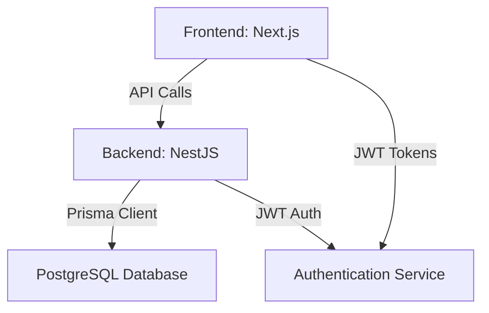
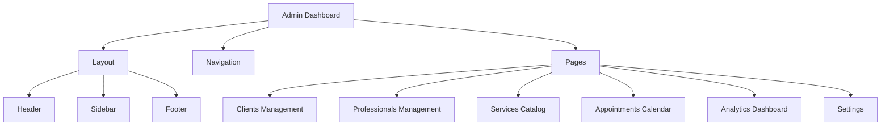

# Phase 3.2: Admin Dashboard - Implementation Plan

**Status:** Planning
**Created:** 2026-01-06
**Updated:** 2026-01-06
**Part of:** KiraRoom SaaS Consolidated Plan

---

## Executive Summary

This plan outlines the implementation of Phase 3.2: Admin Dashboard features for the KiraRoom beauty salon management platform. The admin dashboard will provide salon owners and staff with comprehensive management tools for clients, professionals, services, appointments, and analytics.

---

## Current State Analysis

### Completed Components
- ✅ Backend API with NestJS framework
- ✅ Prisma ORM with PostgreSQL database schema
- ✅ Authentication system (JWT-based)
- ✅ Basic frontend structure with Next.js
- ✅ Core data models (Tenant, User, Client, Professional, Service, Appointment)

### Missing Components for Phase 3.2
- ❌ Admin dashboard UI/UX
- ❌ CRUD operations for admin entities
- ❌ Appointment calendar view
- ❌ Analytics dashboard
- ❌ Role-based access control for admin features

---

## Architecture Overview

### System Architecture



### Admin Dashboard Components



---

## Implementation Plan

### Step 1: Backend API Enhancements

#### 1.1 Admin-Specific API Endpoints

**Clients Management:**
```
GET    /api/v1/admin/clients          - List all clients
POST   /api/v1/admin/clients          - Create new client
GET    /api/v1/admin/clients/:id      - Get client details
PUT    /api/v1/admin/clients/:id      - Update client
DELETE /api/v1/admin/clients/:id      - Delete client
GET    /api/v1/admin/clients/search   - Search clients
```

**Professionals Management:**
```
GET    /api/v1/admin/professionals          - List all professionals
POST   /api/v1/admin/professionals          - Create new professional
GET    /api/v1/admin/professionals/:id      - Get professional details
PUT    /api/v1/admin/professionals/:id      - Update professional
DELETE /api/v1/admin/professionals/:id      - Delete professional
GET    /api/v1/admin/professionals/availability - Get availability
```

**Services Catalog:**
```
GET    /api/v1/admin/services          - List all services
POST   /api/v1/admin/services          - Create new service
GET    /api/v1/admin/services/:id      - Get service details
PUT    /api/v1/admin/services/:id      - Update service
DELETE /api/v1/admin/services/:id      - Delete service
GET    /api/v1/admin/services/categories - Get service categories
```

**Appointments Management:**
```
GET    /api/v1/admin/appointments          - List all appointments
POST   /api/v1/admin/appointments          - Create appointment
GET    /api/v1/admin/appointments/:id      - Get appointment details
PUT    /api/v1/admin/appointments/:id      - Update appointment
DELETE /api/v1/admin/appointments/:id      - Cancel appointment
GET    /api/v1/admin/appointments/calendar - Get calendar data
POST   /api/v1/admin/appointments/confirm  - Confirm appointment
POST   /api/v1/admin/appointments/cancel    - Cancel appointment
```

**Analytics:**
```
GET    /api/v1/admin/analytics/summary          - Get summary statistics
GET    /api/v1/admin/analytics/revenue          - Get revenue data
GET    /api/v1/admin/analytics/appointments     - Get appointment metrics
GET    /api/v1/admin/analytics/clients          - Get client metrics
GET    /api/v1/admin/analytics/services         - Get service popularity
```

#### 1.2 Backend Implementation Tasks

- [ ] Create `AdminClientsController` with CRUD endpoints
- [ ] Create `AdminProfessionalsController` with CRUD endpoints
- [ ] Create `AdminServicesController` with CRUD endpoints
- [ ] Create `AdminAppointmentsController` with calendar and management endpoints
- [ ] Create `AdminAnalyticsController` with dashboard data endpoints
- [ ] Add role-based guards for admin routes
- [ ] Implement data validation and error handling
- [ ] Add pagination and filtering support
- [ ] Implement search functionality for clients and professionals

---

### Step 2: Frontend Admin Dashboard

#### 2.1 Dashboard Structure

```
packages/frontend/app/
├── dashboard/
│   ├── layout.tsx          # Dashboard layout wrapper
│   ├── page.tsx            # Dashboard home/overview
│   ├── clients/
│   │   ├── page.tsx        # Clients list
│   │   ├── [id]/
│   │   │   └── page.tsx    # Client details
│   │   └── new/
│   │       └── page.tsx    # New client form
│   ├── professionals/
│   │   ├── page.tsx        # Professionals list
│   │   ├── [id]/
│   │   │   └── page.tsx    # Professional details
│   │   └── new/
│   │       └── page.tsx    # New professional form
│   ├── services/
│   │   ├── page.tsx        # Services list
│   │   ├── [id]/
│   │   │   └── page.tsx    # Service details
│   │   └── new/
│   │       └── page.tsx    # New service form
│   ├── appointments/
│   │   ├── page.tsx        # Appointments calendar
│   │   ├── [id]/
│   │   │   └── page.tsx    # Appointment details
│   │   └── new/
│   │       └── page.tsx    # New appointment form
│   └── analytics/
│       └── page.tsx        # Analytics dashboard
└── ...
```

#### 2.2 UI Components

**Layout Components:**
- `DashboardLayout`: Main layout with sidebar and header
- `DashboardSidebar`: Navigation sidebar with menu items
- `DashboardHeader`: Top header with user info and notifications
- `Breadcrumb`: Navigation breadcrumb

**Page Components:**
- `ClientList`: Data table for clients with search/filter
- `ClientForm`: Form for creating/editing clients
- `ProfessionalList`: Data table for professionals
- `ProfessionalForm`: Form for professionals with availability
- `ServiceList`: Data table for services
- `ServiceForm`: Form for services with pricing and categories
- `AppointmentCalendar`: Full calendar view with drag-and-drop
- `AppointmentForm`: Form for creating/editing appointments
- `AnalyticsDashboard`: Charts and metrics display

#### 2.3 Frontend Implementation Tasks

- [ ] Create dashboard layout with responsive design
- [ ] Implement authentication-aware routing
- [ ] Create CRUD interfaces for clients
- [ ] Create CRUD interfaces for professionals
- [ ] Create CRUD interfaces for services
- [ ] Implement appointment calendar with FullCalendar
- [ ] Create analytics dashboard with charts
- [ ] Add loading states and error handling
- [ ] Implement form validation
- [ ] Add search and filtering functionality
- [ ] Implement pagination for data tables

---

### Step 3: Authentication and Authorization

#### 3.1 Role-Based Access Control

**User Roles:**
- `owner`: Full access to all features
- `admin`: Full access except tenant settings
- `staff`: Limited access (appointments, clients)
- `client`: No admin access

**Route Protection:**
```typescript
// Example: Admin route guard
@UseGuards(JwtAuthGuard, RolesGuard)
@Roles('owner', 'admin')
@Controller('admin/clients')
export class AdminClientsController {}
```

#### 3.2 Frontend Auth Integration

- [ ] Create auth context for user session management
- [ ] Implement protected routes for admin dashboard
- [ ] Add role-based UI element visibility
- [ ] Implement token refresh mechanism
- [ ] Add logout functionality

---

### Step 4: Appointment Calendar Implementation

#### 4.1 Calendar Features

- Weekly, monthly, and daily views
- Drag-and-drop appointment rescheduling
- Color-coded by service type/professional
- Quick appointment creation
- Conflict detection
- Timezone support

#### 4.2 Technical Implementation

```typescript
// Frontend calendar integration
import FullCalendar from '@fullcalendar/react'
import dayGridPlugin from '@fullcalendar/daygrid'
import timeGridPlugin from '@fullcalendar/timegrid'
import interactionPlugin from '@fullcalendar/interaction'

<FullCalendar
  plugins={[dayGridPlugin, timeGridPlugin, interactionPlugin]}
  initialView="timeGridWeek"
  events={appointments}
  editable={true}
  selectable={true}
  eventClick={handleEventClick}
  eventDrop={handleEventDrop}
/>
```

---

### Step 5: Analytics Dashboard

#### 5.1 Key Metrics

**Summary Statistics:**
- Total clients
- Total appointments (today, this week, this month)
- Revenue (today, this week, this month)
- Occupancy rate
- Average appointment value

**Charts:**
- Revenue over time (line chart)
- Appointment status distribution (pie chart)
- Service popularity (bar chart)
- Client acquisition (line chart)
- Professional utilization (bar chart)

#### 5.2 Data Requirements

```typescript
interface AnalyticsSummary {
  totalClients: number;
  totalAppointments: number;
  todayAppointments: number;
  thisWeekAppointments: number;
  thisMonthAppointments: number;
  todayRevenue: number;
  thisWeekRevenue: number;
  thisMonthRevenue: number;
  occupancyRate: number;
  averageAppointmentValue: number;
}

interface RevenueData {
  date: string;
  amount: number;
}

interface AppointmentStatusData {
  status: string;
  count: number;
}
```

---

## Technical Specifications

### Backend Technologies

- **Framework:** NestJS
- **ORM:** Prisma
- **Database:** PostgreSQL
- **Authentication:** JWT with Passport
- **Validation:** class-validator
- **Documentation:** Swagger/OpenAPI

### Frontend Technologies

- **Framework:** Next.js 14
- **UI Components:** shadcn/ui (Radix-based)
- **Styling:** Tailwind CSS
- **State Management:** React Context + SWR
- **Forms:** React Hook Form + Zod
- **Charts:** Chart.js or Recharts
- **Calendar:** FullCalendar
- **Icons:** Lucide React

### API Design Principles

- RESTful endpoints with proper HTTP methods
- Consistent naming conventions
- Proper error handling and status codes
- Request/response validation
- Pagination for large datasets
- Rate limiting for sensitive operations

---

## Implementation Timeline

### Week 1: Backend Foundation

**Day 1-2:**
- [ ] Set up admin API module structure
- [ ] Create base admin controller and service
- [ ] Implement role-based guards
- [ ] Add admin-specific DTOs

**Day 3-4:**
- [ ] Implement clients CRUD endpoints
- [ ] Implement professionals CRUD endpoints
- [ ] Add validation and error handling

**Day 5:**
- [ ] Implement services CRUD endpoints
- [ ] Add search functionality
- [ ] Test all CRUD operations

### Week 2: Frontend Foundation & Calendar

**Day 6-7:**
- [ ] Create dashboard layout structure
- [ ] Implement authentication integration
- [ ] Set up routing and navigation

**Day 8-9:**
- [ ] Implement clients management UI
- [ ] Implement professionals management UI
- [ ] Implement services management UI

**Day 10:**
- [ ] Set up FullCalendar integration
- [ ] Implement appointment data fetching
- [ ] Add basic calendar interactions

### Week 3: Advanced Features & Testing

**Day 11-12:**
- [ ] Implement appointment management features
- [ ] Add drag-and-drop functionality
- [ ] Implement conflict detection

**Day 13-14:**
- [ ] Create analytics dashboard
- [ ] Implement data visualization
- [ ] Add real-time updates

**Day 15:**
- [ ] Comprehensive testing
- [ ] Bug fixing
- [ ] Performance optimization

---

## Success Criteria

### Backend Success Criteria
- [ ] All admin API endpoints implemented and documented
- [ ] Proper authentication and authorization
- [ ] Comprehensive error handling
- [ ] Input validation for all endpoints
- [ ] Pagination and filtering support
- [ ] 90%+ test coverage for admin features

### Frontend Success Criteria
- [ ] Responsive dashboard layout
- [ ] All CRUD operations functional
- [ ] Calendar view with full functionality
- [ ] Analytics dashboard with charts
- [ ] Proper error handling and user feedback
- [ ] Loading states for async operations
- [ ] Accessibility compliance

### Integration Success Criteria
- [ ] Seamless API integration
- [ ] Proper authentication flow
- [ ] Real-time updates where applicable
- [ ] Consistent data across all views
- [ ] Mobile-responsive design

---

## Risk Assessment

### Technical Risks

1. **Complex State Management**
   - Mitigation: Use established patterns (React Context + SWR)
   - Fallback: Implement Redux if complexity grows

2. **Calendar Performance**
   - Mitigation: Implement virtualization for large datasets
   - Fallback: Use server-side pagination for calendar data

3. **Authentication Complexity**
   - Mitigation: Reuse existing auth system
   - Fallback: Implement dedicated admin auth flow

### Timeline Risks

1. **Underestimated UI Complexity**
   - Mitigation: Use existing component library (shadcn/ui)
   - Fallback: Prioritize core functionality first

2. **Integration Challenges**
   - Mitigation: Early API testing and validation
   - Fallback: Implement mock data for frontend development

---

## Next Steps

1. **Immediate Actions:**
   - Review and approve this implementation plan
   - Set up development environment
   - Create necessary database migrations

2. **First Sprint:**
   - Implement backend admin API foundation
   - Create basic dashboard layout
   - Set up authentication integration

3. **Dependencies:**
   - Phase 1 (Blockers) must be resolved
   - Phase 2 (Core Features) authentication must be working
   - Database must be operational

---

## Approval

**Plan Status:** Draft
**Reviewed By:** 
**Approved By:** 
**Approval Date:** 

---

## Change Log

- **2026-01-06:** Initial draft created
- **2026-01-06:** Added detailed technical specifications
- **2026-01-06:** Included risk assessment and success criteria