# Phase 3.2: Admin Dashboard - Architecture Documentation

**Created:** 2026-01-06
**Updated:** 2026-01-06
**Status:** Draft

---

## System Architecture Overview

### High-Level Architecture

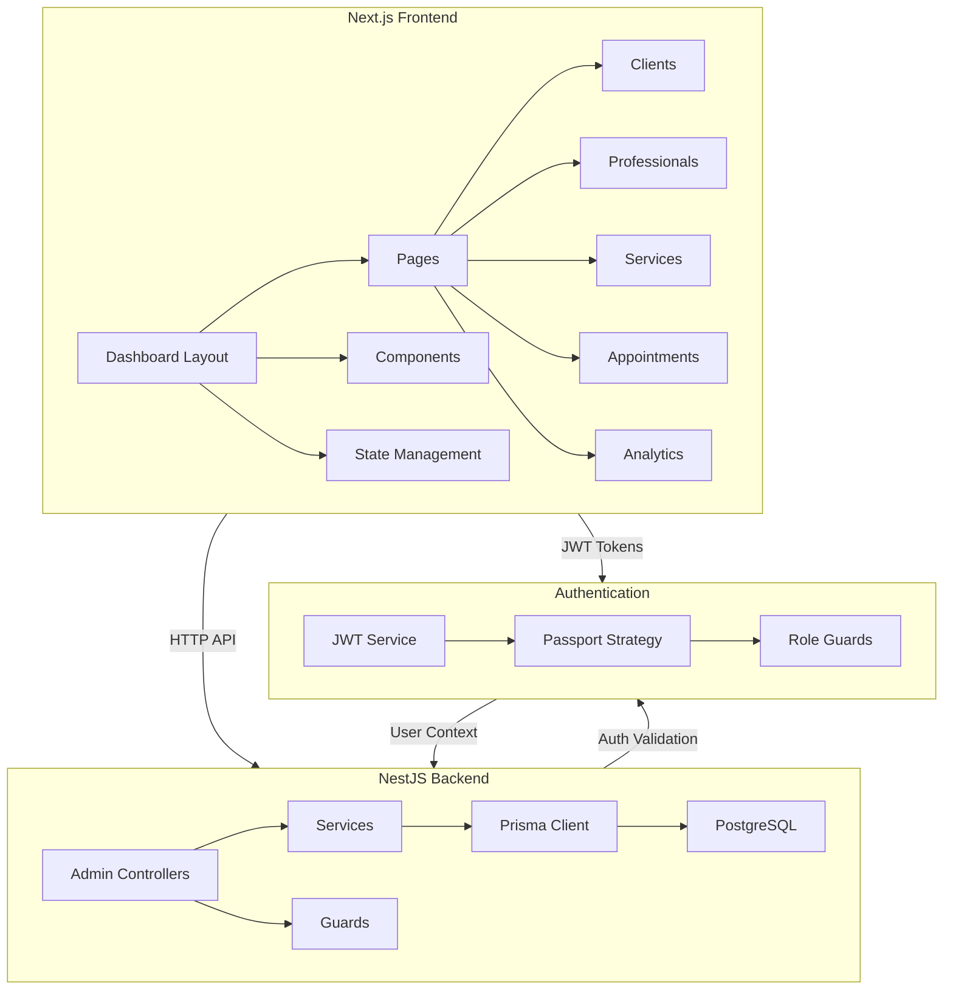

---

## Component Architecture

### Frontend Component Hierarchy

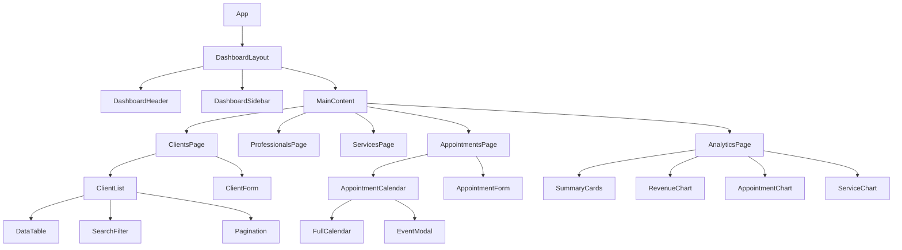

---

## Data Flow Architecture

### Clients Management Data Flow

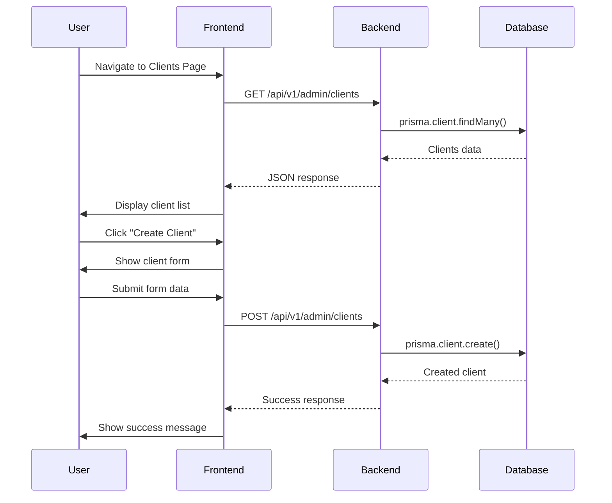

---

## API Architecture

### RESTful API Design

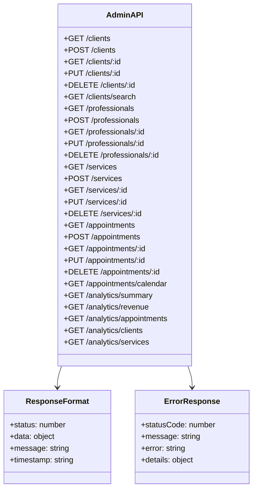

---

## Database Architecture

### Entity Relationship Diagram (Simplified)

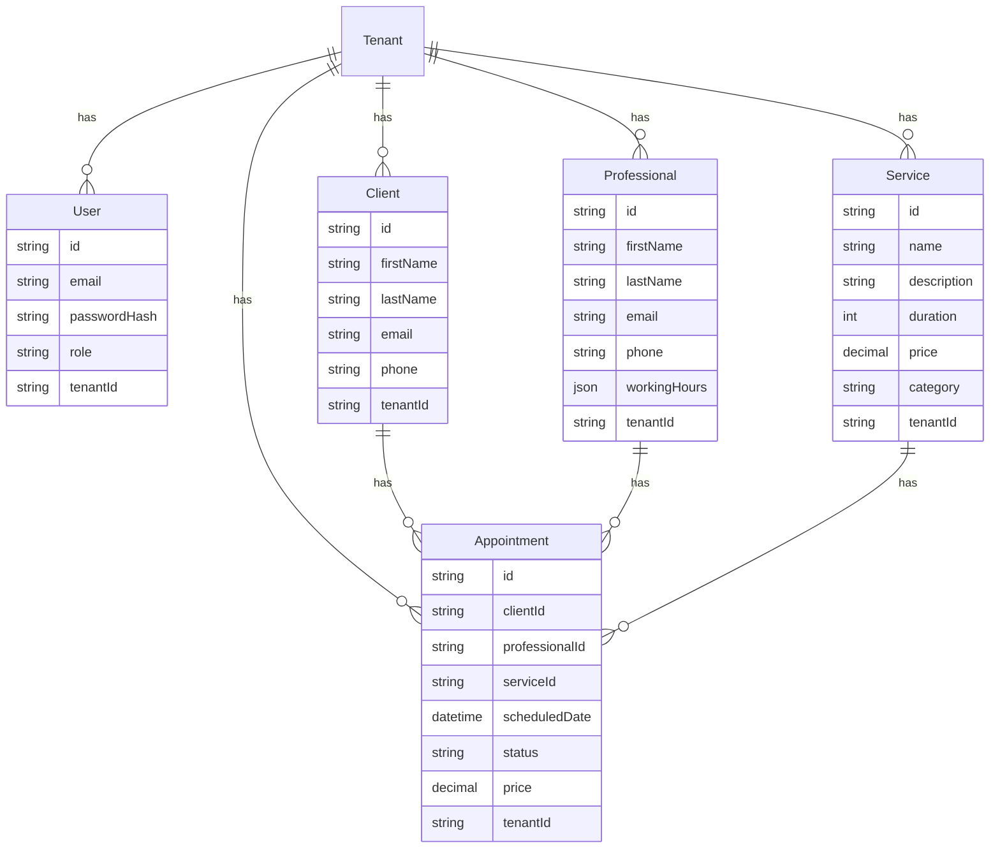

---

## Authentication Architecture

### JWT Authentication Flow

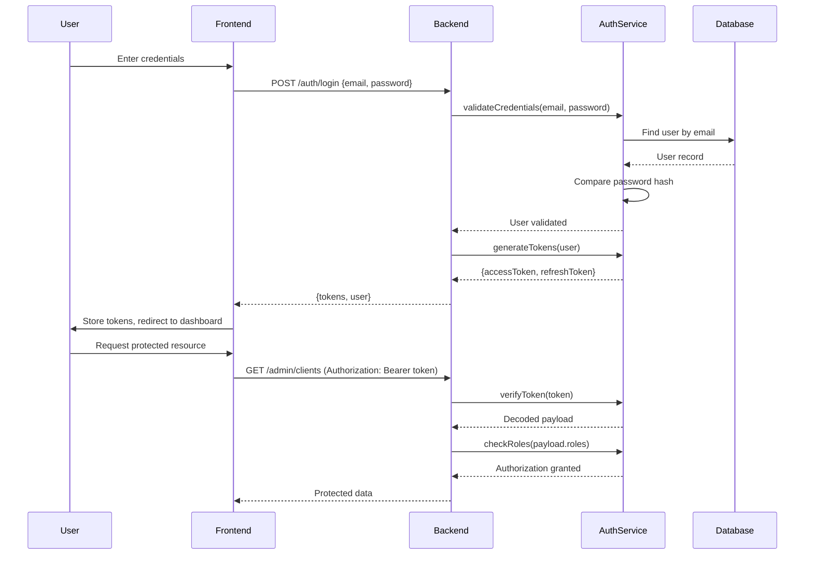

---

## Frontend State Management Architecture

### State Management Strategy

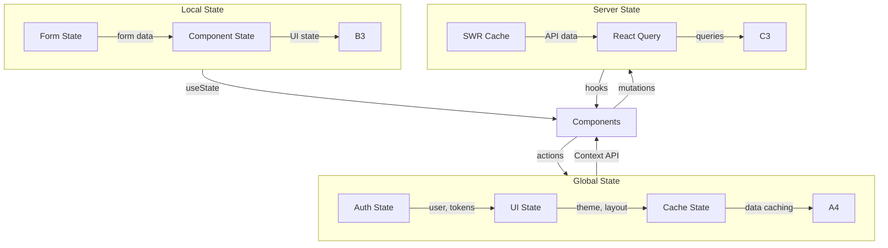

---

## Error Handling Architecture

### Error Handling Flow

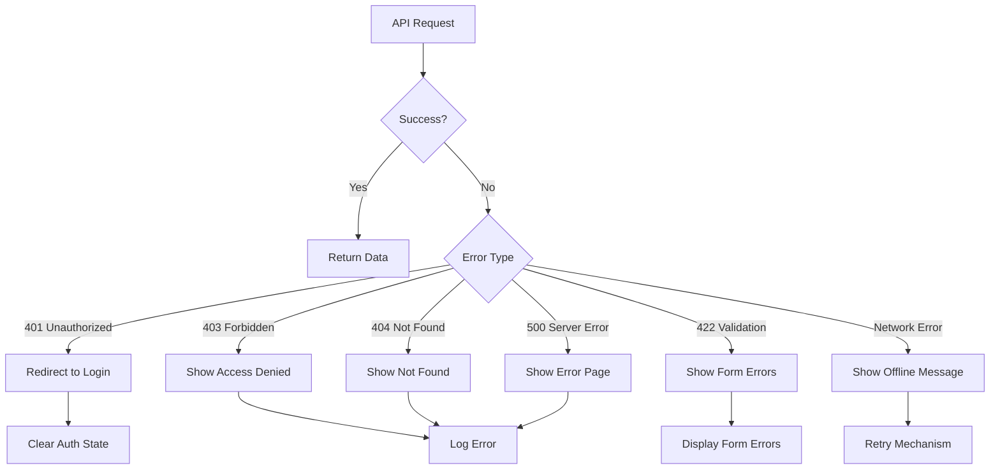

---

## Performance Architecture

### Performance Optimization Strategy

```mermaid
graph TD
    A[Frontend Performance] --> B[Code Splitting]
    A --> C[Lazy Loading]
    A --> D[Bundle Optimization]
    A --> E[Image Optimization]
    
    F[Backend Performance] --> G[Database Indexing]
    F --> H[Query Optimization]
    F --> I[Caching Strategy]
    F --> J[Connection Pooling]
    
    K[API Performance] --> L[Pagination]
    K --> M[Response Compression]
    K --> N[Rate Limiting]
    K --> O[ETag Caching]
    
    P[Monitoring] --> Q[Performance Metrics]
    P --> R[Error Tracking]
    P --> S[Logging]
```

---

## Security Architecture

### Security Layers

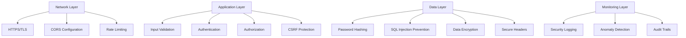

---

## Deployment Architecture

### Production Deployment

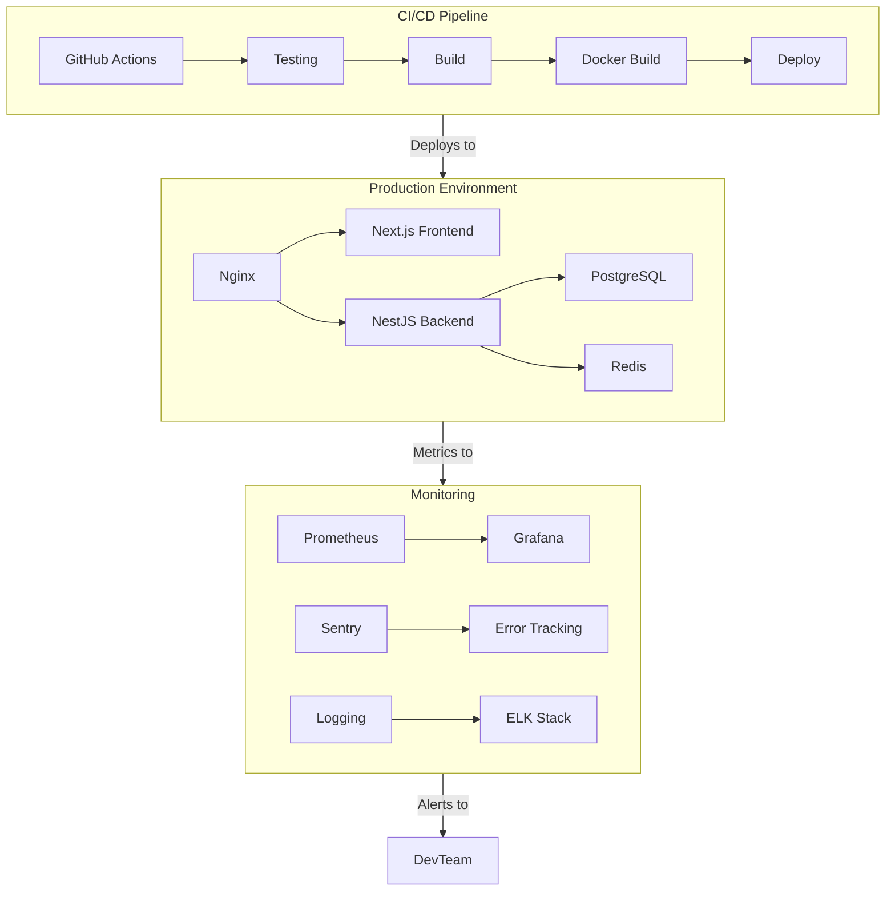

---

## Technical Decisions

### Key Architectural Decisions

1. **Monorepo Structure**
   - Decision: Use Nx monorepo for shared code
   - Rationale: Better code sharing, unified tooling
   - Impact: Simplified dependency management

2. **Authentication Strategy**
   - Decision: JWT with refresh tokens
   - Rationale: Stateless, scalable, industry standard
   - Impact: Requires proper token management

3. **State Management**
   - Decision: Context API + SWR
   - Rationale: Simpler than Redux, built-in caching
   - Impact: May need Redux for complex state

4. **UI Framework**
   - Decision: shadcn/ui with Tailwind
   - Rationale: Customizable, accessible, modern
   - Impact: Learning curve for Tailwind

5. **Calendar Library**
   - Decision: FullCalendar
   - Rationale: Feature-rich, well-documented
   - Impact: Bundle size consideration

---

## Future Considerations

### Scalability Path

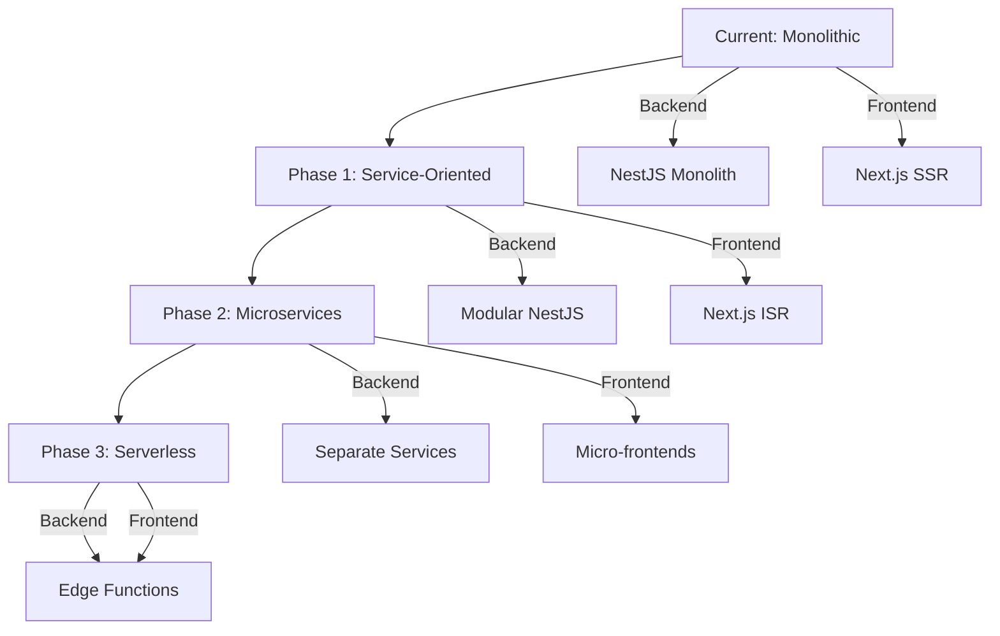

---

## Appendix

### Glossary

- **CRUD**: Create, Read, Update, Delete operations
- **JWT**: JSON Web Token for authentication
- **Prisma**: ORM for database access
- **SWR**: React hooks for data fetching
- **DTO**: Data Transfer Object
- **RBAC**: Role-Based Access Control

### References

- Main Plan: [`CONSOLIDATED-PLAN.md`](CONSOLIDATED-PLAN.md)
- Database Schema: [`docs/database-schema.md`](../docs/database-schema.md)
- API Design: [`docs/api-design.md`](../docs/api-design.md)

---

## Change Log

- **2026-01-06:** Initial architecture documentation created
- **2026-01-06:** Added detailed diagrams and flow charts
- **2026-01-06:** Included security and performance considerations